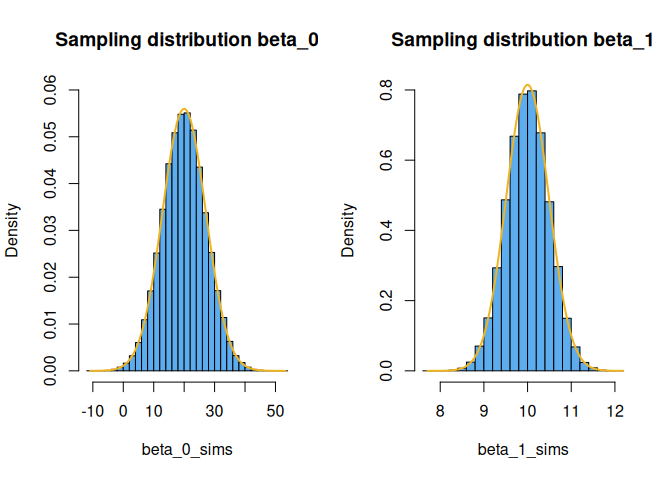

Sampling distributions for parameters in the linear model
================
Brett Melbourne
2025-10-21

> The `.md` version of this document is best for viewing on GitHub. See
> the `.Rmd` version for the latex equation markup. The `.Rmd` version
> does not display the plots in GitHub and is best for viewing within
> Positron or RStudio.

In science, we are often (but not always) directly focused on inferences
about the parameters of models. The parameters of the linear model are
the intercept and the slope. For example, our science question might
lead us to be focused on the value of the slope. Is it steep or shallow?
Does it represent a rate? Is it positive or negative? Is it non-zero?
etc. Frequentist inferences all stem from inference algorithms based on
the **sampling distribution**. Here, we look at the sampling
distributions for the parameters in the linear model.

Recall that the fundamental frequentist idea is that we should imagine
sampling repeatedly from a population. In the standard approach to
inference for the linear model, the imagined population that we sample
from is an infinite **population of errors**, $e,$ in the linear model:

$$ y_i = \beta_0 + \beta_1x_i + e_i$$

where $i$ indexes the realizations from the stochastic process. If this
population of errors has a Normal distribution $N(0,\sigma_e)$,
mathematical theory shows that the **sampling distributions** of the
parameter estimates for $\beta_0$ and $\beta_1$ are also exactly Normal
with $N(\beta_0,\sigma_0)$ and $N(\beta_1,\sigma_1)$. Even better, the
mathematical theory yields neat equations for the standard deviations
($\sigma_0$ and $\sigma_1$) of these sampling distributions as a
function of the standard deviation of the original errors $\sigma_e$
(see next code block). Thus, in this special case, mathematical theory
is able to give us an exact solution to the sampling distribution
algorithm.

More generally, we can implement the **sampling distribution algorithm**
directly (this approach can be used for any kind of model for the data
generating process). For the parameters of the linear model, here is the
pseudocode:

    repeat very many times
        sample data from the population
        train the linear model to estimate the parameters
    plot sampling distributions (histograms) of the parameter estimates

Here is the algorithm, implemented in R, compared to the mathematical
theory:

``` r
# Simulation of sampling distribution for estimated beta_0 and beta_1
# About 1 minute

# Make example reproducible
set.seed(4.6)

# Set the true population parameters and constants
beta_0 <- 20                    #true y intercept
beta_1 <- 10                    #true slope
sigma_e <- 20                   #true standard deviation of the errors
n <- 30                         #size of dataset
x <- seq(0, 25, length.out=n)   #independent variable, fixed values

# Sampling distribution algorithm
reps <- 100000                  #Set larger for even better precision
beta_0_sims <- rep(NA, reps)    #to store sim results
beta_1_sims <- rep(NA, reps)
for ( i in 1:reps ) {
    e <- rnorm(n, mean=0, sd=sigma_e)     #sample from population of errors
    y_sim <- beta_0 + beta_1 * x + e      #simulate data for y
    fit_sim <- lm(y_sim ~ x)              #train linear model
    beta_0_sims[i] <- coef(fit_sim)[1]    #estimated beta_0
    beta_1_sims[i] <- coef(fit_sim)[2]    #estimated beta_1
}

# Plot simulated sampling distributions and compare to theory
par(mfrow=c(1,2))

# Simulated sampling distribution for beta_0
hist(beta_0_sims, freq=FALSE, breaks=30, ylim=c(0,0.06), col="steelblue2",
     main="Sampling distribution beta_0")

# Theoretical sampling distribution for beta_0
varp_x <- mean((x - mean(x))^2) #population variance of x
k_0 <- sqrt(1 + mean(x)^2 / varp_x)
sigma_0 <- k_0 * sigma_e / sqrt(n)
bb <- seq(min(beta_0_sims), max(beta_0_sims), length.out=100)
pdensity_b_0 <- dnorm(bb, mean=beta_0, sd=sigma_0) #Normal(beta_0,sigma_0)
lines(bb, pdensity_b_0, lwd=2, col="goldenrod2")

# Simulated sampling distribution for beta_1
hist(beta_1_sims, freq=FALSE, breaks=30, ylim=c(0,0.8), col="steelblue2",
     main="Sampling distribution beta_1")

# Theoretical sampling distribution for beta_1
k_1 <- 1 / sqrt( varp_x )
sigma_1 <- k_1 * sigma_e / sqrt(n)
bb <- seq(min(beta_1_sims), max(beta_1_sims), length.out=100)
pdensity_b_1 <- dnorm(bb, mean=beta_1, sd=sigma_1) #Normal(beta_1,sigma_1)
lines(bb, pdensity_b_1, lwd=2, col="goldenrod2")
```

<!-- -->

There is an extremely close match of the mathematical theory (curve) and
the direct sampling distribution algorithm (histogram). We used a large
number of replications (100,000) to inspect this concordance. You can
increase the replication further to see that the theory exactly matches
the algorithm. This demonstrates that the mathematical theory for the
sampling distribution is sound. Most importantly, it demonstrates that
the sampling distribution algorithm is very simple (a few lines of
pseudocode) and that we can implement it directly. The algorithm is
fundamental; the math provides a convenient solution to it.
