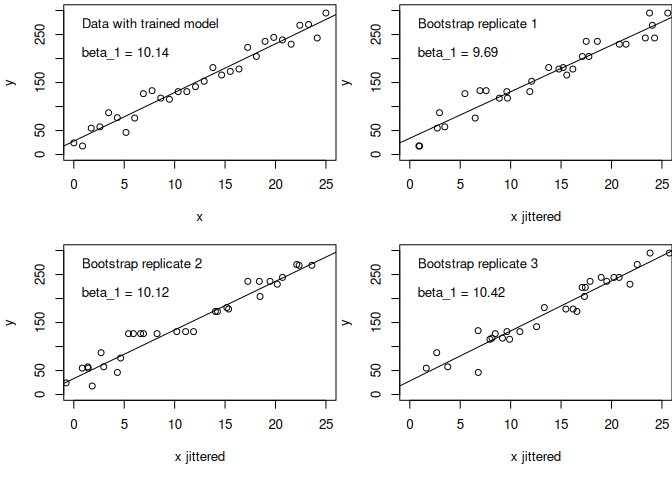
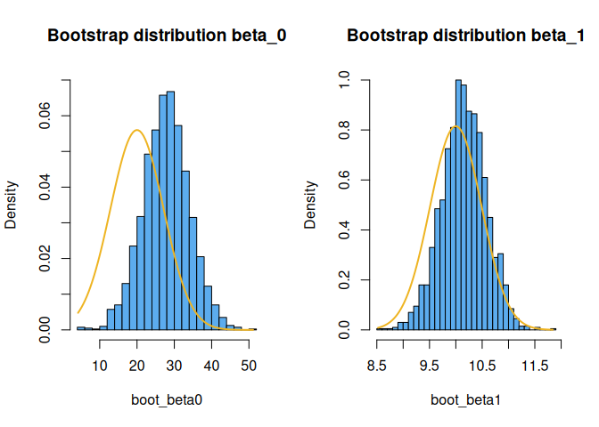
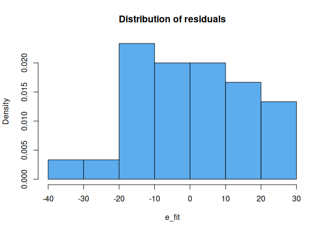
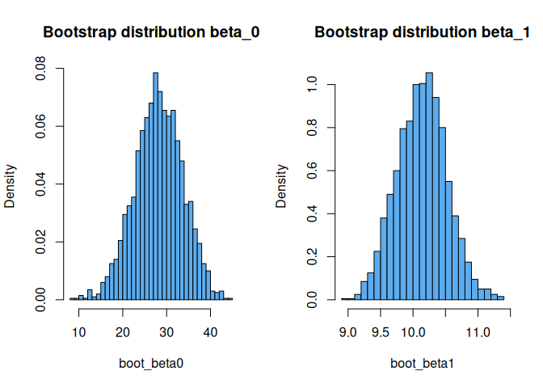
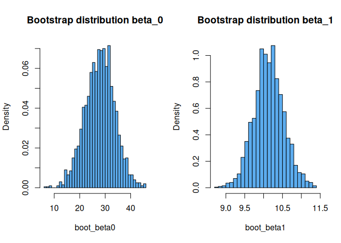
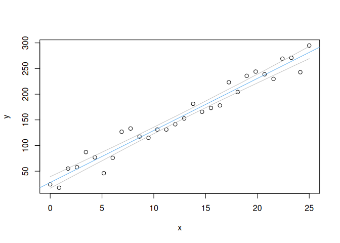

Bootstrap algorithms
================
Brett Melbourne
22 Oct 2025

## Plugging in information from the sample algorithmically

So far we’ve seen that the sampling distribution, the distribution of a
sample statistic under repeated sampling from the population, is the
core of frequentist inference. Since we don’t have direct access to the
true sampling distribution, we’ve also seen that the **plug in
principle** is used, whereby properties of the single sample are used to
stand in for unknown properties of the sampling distribution. In the
linear model case, the plug in quantity was the residual standard error,
$\hat{\sigma}_e$ (the standard error of the deviations after the model
was trained to find the parameters that minimized the error). The
bootstrap is a **more direct** and **algorithmic** approach to the plug
in principle.

Recall the sampling distribution algorithm for the parameters
(y-intercept or slope) of the simple linear model:

    repeat very many times
        sample data from the population
        train the linear model to estimate the parameters
    plot sampling distribution (histogram) of the parameter estimates

At the first step, “sample data from the population”, there is an
unknown distribution of the population. The bootstrap does the plug in
here.

## Non-parametric bootstrap

There are several ways of plugging in a distribution for the population
at the “sample data from the population” step. The first way is to use
the data from the sample. This is called the non-parametric bootstrap.
For our simple linear model, the non-parametric bootstrap algorithm is:

    repeat very many times
        resample data (with replacement) from the single sample
        train the linear model to estimate the parameters
    plot sampling distribution (histogram) of the parameter estimates

First we’ll generate some fake data for illustration. We’ll use the same
data as before. Recall that what we’re doing here is drawing one sample
dataset from the “true” population with known parameters.

``` r
set.seed(4.6) #make example reproducible
beta_0 <- 20 #true y intercept
beta_1 <- 10 #true slope
sigma_e <- 20  #true standard deviation of the errors
n <- 30  #size of dataset
x <- seq(0, 25, length.out=n)   #independent variable, fixed values
y <- beta_0 + beta_1 * x + rnorm(n, sd=sigma_e) #random sample of y from the population
df <- data.frame(x, y)
```

Here is the model trained on these data and then simulating the first
three bootstrap replicates:

``` r
par(mfrow=c(2,2), mar=c(5,4,0.3,0))

# Plot the data with trained model
ylim <- c(0,300)
xlim <- c(0,25)
with(df, plot(x, y, xlim=xlim, ylim=ylim))
fit <- lm(y ~ x, data=df)
abline(fit)
text(0, 0.9*300, "Data with trained model", pos=4)
beta1_lab <- paste( "beta_1 =", round(coef(fit)[2], 2) )
text(0, 0.7*300, beta1_lab, pos=4)

# The first 3 bootstrap replicates
for ( i in 1:3 ) {
    # Resample data in y,x pairs from the sample with replacement
    df_boot <- df[sample(1:n, replace=TRUE),] #sample y,x pairs
    # Train the linear model
    fit_boot <- lm(y ~ x, data=df_boot)
    # Get the parameter estimate
    beta1_lab <- paste("beta_1 =", round(coef(fit_boot)[2], 2))
    # Plot this single bootstrap replicate
    with(df_boot, plot(jitter(x, 10), y, xlim=xlim, ylim=ylim, xlab="x jittered"))
    abline(fit_boot)
    text(0, 0.9*300, paste("Bootstrap replicate", i), pos=4)
    text(0, 0.7*300, beta1_lab, pos=4)
}
```

<!-- -->

You can see that because we’ve resampled datasets from the original data
with replacement, the new datasets don’t have all the (x,y) pairs from
the original dataset and instead have some repeated (x,y) pairs
(revealed by the jittering on the x axis). This may seem odd but the
idea is that we’re using information in the data to gain information
about the sampling distribution. The bootstrapped fits of the linear
models give us new estimates of the slope, $\beta_1$. Now here is the
full bootstrapped sampling distribution for $\beta_0$ and $\beta_1$, and
we’ll compare it to the true sampling distribution for this population:

``` r
reps <- 2000
boot_beta0 <- rep(NA, reps)
boot_beta1 <- rep(NA, reps)

for ( i in 1:reps ) {
    # Resample data in y,x pairs from the sample with replacement
    df_boot <- df[sample(1:n, replace=TRUE),] #sample y,x pairs
    # Train the linear model
    fit_boot <- lm(y ~ x, data=df_boot)
    # Keep the parameter estimates
    boot_beta0[i] <- coef(fit_boot)[1]
    boot_beta1[i] <- coef(fit_boot)[2]
}

par(mfrow=c(1,2))

# Bootstrap distribution for beta_0
hist(boot_beta0, freq=FALSE, breaks=30, ylim=c(0, 0.07), col="steelblue2",
     main="Bootstrap distribution beta_0")

# Theoretical "true" sampling distribution for beta_0
varp_x <- mean((x - mean(x))^2) #population variance of x
k_0 <- sqrt(1 + mean(x)^2 / varp_x)
sigma_0 <- k_0 * sigma_e / sqrt(n)
bb <- seq(min(boot_beta0), max(boot_beta0), length.out=100)
pdensity_b_0 <- dnorm(bb, mean=beta_0, sd=sigma_0) #Normal(beta_0,sigma_0)
lines(bb, pdensity_b_0, lwd=2, col="goldenrod2")

# Bootstrap distribution for beta_1
hist(boot_beta1, freq=FALSE, breaks=30, ylim=c(0,1.0), col="steelblue2",
     main="Bootstrap distribution beta_1")

# Theoretical "true" sampling distribution for beta_1
k_1 <- 1 / sqrt( varp_x )
sigma_1 <- k_1 * sigma_e / sqrt(n)
bb <- seq(min(boot_beta1), max(boot_beta1), length.out=100)
pdensity_b_1 <- dnorm(bb, mean=beta_1, sd=sigma_1) #Normal(beta_1,sigma_1)
lines(bb, pdensity_b_1, lwd=2, col="goldenrod2")
```

<!-- -->

We see that the bootstrap distributions (histograms) are not the same as
the true sampling distributions (orange curve). But of course we expect
that. The data are one realization, a **sample**, from the population
with true values of $\beta_0$ = 20 and $\beta_1$ = 10. Since we’re using
the sample data, our bootstrap distribution is going to reflect the
properties of the sample. In particular, we expect the means of the
bootstrap distribution to be at the estimated values of the one sample
that is our data. However, we see that despite the offset, the bootstrap
distributions are shaped roughly like the true sampling distributions.
We can see this more obviously if we compare the standard deviations of
the bootstrap distributions to the standard error of the classical
estimate from the linear regression:

``` r
sd(boot_beta0)
```

    ## [1] 6.198988

``` r
sd(boot_beta1)
```

    ## [1] 0.4217797

``` r
summary(fit)$coefficients
```

    ##             Estimate Std. Error   t value     Pr(>|t|)
    ## (Intercept) 27.97932  5.8429046  4.788598 4.943299e-05
    ## x           10.14115  0.4013631 25.266784 8.147049e-21

Now we see that the bootstrap estimates of the standard error for the
two parameters are very similar. To recap, what we’ve done is attempt to
recreate the sampling distribution by using the data in the sample as a
**plug in** for the population distribution of (x,y) and we see that
this non-parameteric bootstrap quite accurately recovers the standard
error. The non-parametric bootstrap is a simple algorithm that can be
applied quite widely to a range of problems.

## Empirical bootstrap

Now, let’s look at a slightly more sophisticated bootstrap algorithm.
Recall that the linear model is:

$$ y_i = \beta_0 + \beta_1x_i + e_i$$

and that one way of thinking about this model in terms of the sampling
distribution is that the imagined population that we repeatedly sample
from is a **population of errors**, $e$. The empirical bootstrap uses
this idea directly using the following algorithm:

    repeat very many times
        resample the errors (with replacement) from the single sample
        simulate new y-values from the estimated parameters and resampled errors
        train the linear model to estimate the parameters
    plot sampling distribution (histogram) of the parameter estimates

So what we’re going to do here is draw from the following distribution
of errors from the model trained on our original data:

``` r
e_fit <- fit$residuals
hist(e_fit, freq=FALSE, col="steelblue2", main="Distribution of residuals")
```

<!-- -->

Notice that the distribution of these residuals, the $e_i\mathrm{s}$
from our one sample, are not particularly Normal looking, even though we
know they were in fact drawn from a Normal distribution (our simulated
truth). A feature of the empirical bootstrap is that we don’t make an
assumption about the distribution from which the errors were drawn but
instead use the information in the sample to tell us about it.

Here is the R implementation for the empirical bootstrap algorithm:

``` r
reps <- 2000
boot_beta0 <- rep(NA, reps)
boot_beta1 <- rep(NA, reps)
df_boot <- df

for ( i in 1:reps ) {
    # Resample errors from the trained model with replacement
    e_boot <- sample(e_fit, replace=TRUE)
    # Simulate new y-values at the original x values
    df_boot$y <- coef(fit)[1] + coef(fit)[2] * df_boot$x + e_boot
    # Train the linear model
    fit_boot <- lm(y ~ x, data=df_boot)
    # Keep the parameter estimates
    boot_beta0[i] <- coef(fit_boot)[1]
    boot_beta1[i] <- coef(fit_boot)[2]
}

par(mfrow=c(1,2))

# Bootstrap distribution for beta_0
hist(boot_beta0, freq=FALSE, breaks=30, col="steelblue2",
     main="Bootstrap distribution beta_0")

# Bootstrap distribution for beta_1
hist(boot_beta1, freq=FALSE, breaks=30, col="steelblue2",
     main="Bootstrap distribution beta_1")
```

<!-- -->

Compared to the non-parametric bootstrap, we see that these bootstrap
distributions are much more Normal looking. Once again, this is a
consequence of the central limit theorem. Comparing now the standard
deviations of these bootstrap distributions to the standard error of the
classical estimate from the linear regression, we see good concordance:

``` r
sd(boot_beta0)
```

    ## [1] 5.483512

``` r
sd(boot_beta1)
```

    ## [1] 0.3817039

``` r
summary(fit)$coefficients
```

    ##             Estimate Std. Error   t value     Pr(>|t|)
    ## (Intercept) 27.97932  5.8429046  4.788598 4.943299e-05
    ## x           10.14115  0.4013631 25.266784 8.147049e-21

The empirical bootstrap is useful in a wide range of situations where we
have a distribution of residuals and we are less sure about the
underlying distribution.

## Parametric bootstrap

The final version of the bootstrap is the parametric bootstrap. For this
version, we make some additional assumptions. Assumptions are not bad.
They’re modeling devices. “All models are wrong but some are useful”, as
the famous saying goes. In other words, compared to the previous
versions of the bootstrap, we’re doing some additional modeling. It
turns out this version is particularly useful because we can apply it to
essentially any trained parametric model. Crucially, we often need to
call on this approach in more complex models, such as mixed-effect
models, where analytical approaches for the uncertainty are simply not
available for some model estimates.

Here is the algorithm for the parametric bootstrap:

    repeat very many times
        sample from the error distribution
        simulate new y-values from the estimated parameters and errors
        train the linear model to estimate the parameters
    plot sampling distribution (histogram) of the parameter estimates

Steps 1 and 2 within the repetition structure essentially say: “generate
data from the trained model”, where the trained model embodies all the
model assumptions. Our model assumption is that the $e_i\mathrm{s}$ are
drawn from a Normal distribution, so our model is as follows:

$y_i = \beta_0 + \beta_1 x_i + e_i$  
$e_i \sim \mathrm{Normal}(0,\sigma_e)$

Now, we don’t know $\sigma_e$, so we’ll plug in the residual standard
error from the trained model as an estimate. Here is the algorithm in R:

``` r
reps <- 2000
boot_beta0 <- rep(NA, reps)
boot_beta1 <- rep(NA, reps)
df_boot <- df #data frame

# Estimate sigma_e = sqrt(Var(e)). We use the unbiased estimator of the
# variance, where the denominator for the estimate of Var(e) is the residual
# degrees of freedom, n - 2 in the simple linear model because we estimated two
# parameters.
var_e_hat <- sum(fit$residuals ^ 2) / fit$df.residual
sigma_e_hat <- sqrt(var_e_hat)

# Bootstrap realizations
for ( i in 1:reps ) {
    # Sample errors from the Normal distribution
    e_boot <- rnorm(n, 0, sigma_e_hat)
    # Simulate new y-values at the original x values
    df_boot$y <- coef(fit)[1] + coef(fit)[2] * df_boot$x + e_boot
    # Train the linear model
    fit_boot <- lm(y ~ x, data=df_boot)
    # Keep the parameter estimates
    boot_beta0[i] <- coef(fit_boot)[1]
    boot_beta1[i] <- coef(fit_boot)[2]
}

par(mfrow=c(1,2))

# Bootstrap distribution for beta_0
hist(boot_beta0, freq=FALSE, breaks=30, col="steelblue2",
     main="Bootstrap distribution beta_0")

# Bootstrap distribution for beta_1
hist(boot_beta1, freq=FALSE, breaks=30, col="steelblue2",
     main="Bootstrap distribution beta_1")
```

<!-- -->

Again, we see good concordance with the classical estimates for the
standard error:

``` r
sd(boot_beta0)
```

    ## [1] 5.789305

``` r
sd(boot_beta1)
```

    ## [1] 0.3974626

``` r
summary(fit)$coefficients
```

    ##             Estimate Std. Error   t value     Pr(>|t|)
    ## (Intercept) 27.97932  5.8429046  4.788598 4.943299e-05
    ## x           10.14115  0.4013631 25.266784 8.147049e-21

## Bootstrapped confidence intervals

We can construct confidence intervals for the parameters from roughly
twice the bootstrap standard error, or more directly from the 95%
central interval of the bootstrap samples (called the percentile
method):

``` r
# Bootstrap 95% CI for beta_0 from 2 x bootstrap standard error
c(coef(fit)[1] - 2*sd(boot_beta0), coef(fit)[1] + 2*sd(boot_beta0))
```

    ## (Intercept) (Intercept) 
    ##    16.40071    39.55793

``` r
# Bootstrap 95% CI for beta_1 from 2 x bootstrap standard error
c(coef(fit)[2] - 2*sd(boot_beta1), coef(fit)[2] + 2*sd(boot_beta1))
```

    ##         x         x 
    ##  9.346229 10.936079

``` r
# Bootstrap 95% CI for beta_0 from percentile method
quantile(boot_beta0, probs=c(0.025,0.975))
```

    ##     2.5%    97.5% 
    ## 16.40334 38.99691

``` r
# Bootstrap 95% CI for beta_1 from percentile method
quantile(boot_beta1, probs=c(0.025,0.975))
```

    ##      2.5%     97.5% 
    ##  9.381652 10.958371

``` r
# Compare to classical intervals
confint(fit)
```

    ##                 2.5 %   97.5 %
    ## (Intercept) 16.010674 39.94797
    ## x            9.318999 10.96331

We see that these intervals are very similar.

A very powerful use of the parametric bootstrap, is that we can use it
to calculate the uncertainty of **any quantity** that is an output of a
parametric model. All we need to do is keep the bootstrap realizations
of that quantity, which we do in the last part of the repetition
structure above where it says “Keep the parameter estimates”. For
example, in our simple linear model, we can calculate the uncertainty of
the estimated mean of y for a particular value of x, or indeed the
entire range of x, as in a confidence band. Here we calculate 95%
confidence intervals for y as a function of x.

``` r
reps <- 2000
boot_beta0 <- rep(NA, reps)
boot_beta1 <- rep(NA, reps)
df_boot <- df #data frame
xx <- seq(min(df$x), max(df$x), length.out=100)
y_hat <- matrix(NA, nrow=reps, ncol=length(xx))

# Estimate sigma_e (see code above for explanation)
var_e_hat <- sum(fit$residuals ^ 2) / fit$df.residual
sigma_e_hat <- sqrt(var_e_hat)

# Bootstrap realizations
for ( i in 1:reps ) {
    # Sample errors from the Normal distribution
    e_boot <- rnorm(n, 0, sigma_e_hat)
    # Simulate new y-values at the original x values
    df_boot$y <- coef(fit)[1] + coef(fit)[2] * df_boot$x + e_boot
    # Train the linear model
    fit_boot <- lm(y ~ x, data=df_boot)
    # Keep the y estimates for a range of x
    y_hat[i,] <- coef(fit_boot)[1] + coef(fit_boot)[2] * xx
}

# Calculate percentiles for y estimates
ci_upper <- rep(NA, length(xx))
ci_lower <- rep(NA, length(xx))
for ( j in 1:length(xx) ) {
    ci_upper[j] <- quantile(y_hat[,j], prob=0.975)
    ci_lower[j] <- quantile(y_hat[,j], prob=0.025)
}

# Plot the trained model with bootstrapped 95% confidence intervals
with(df, plot(x, y))
abline(fit, col="steelblue2")
lines(xx, ci_upper, col="grey")
lines(xx, ci_lower, col="grey")
```

<!-- -->

## Summary

We’ve seen how the bootstrap is an algorithmic way to obtain inferences
in a frequentist analysis based on the fundamental concept of the
sampling distribution. The bootstrap can be used for models and model
quantities where analytical inferences are unavailable. The different
versions of the bootstrap use different plug-ins for the sampling
distribution:

- non-parametric bootstrap: resample the data with replacement
- empirical bootstrap: resample the errors with replacement
- parametric bootstrap: sample from the parametric distribution
