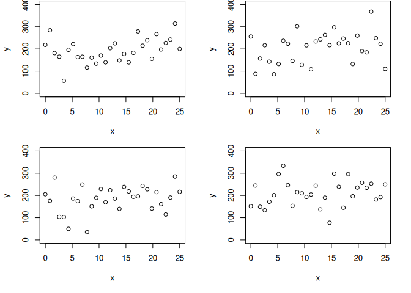

Likelihood inference using Normal linear model as example
================
Brett Melbourne
2020-09-18 (revised 2025-10-29)

> The .md version of this document is best for viewing on GitHub or as a
> preview in Rstudio. See the .Rmd version for the latex equation
> markup. The .Rmd version does not display the plots in GitHub and is
> best for viewing and exploring code within Positron or RStudio.

<!-- This version is slightly abbreviated. Can add more material from the lecture slides as well. -->

I outline model, training, and inference algorithms for a pure
likelihood paradigm. These algorithms can be applied to a wide range of
models, including nonlinear and process-based models, so these
algorithms are quite general, although it becomes increasingly difficult
to optimize nonlinear and hierarchical models as the number of
parameters goes up. Here, it is applied to the simple Normal linear
model.

## Learning goals

- Gain an intuition for model algorithms, training algorithms, and
  inference algorithms from a pure likelihood perspective (in contrast
  to frequentist or Bayesian).
- Understand likelihood by working with likelihood by itself as a
  pedagogical step toward Bayesian inference, in which the likelihood
  plays a central role and contains the most important assumptions.
- Understand how to specify the data generating process as a complete
  stochastic model and express as a model algorithm.
- Understand how the likelihood is derived from the data generating
  process (DGP).
- Understand how the model is trained by optimization to obtain maximum
  likelihood estimates for model parameters and recognize that this is
  the next step up in sophistication compared to training using sum of
  squares.
- Understand how likelihood ratios of model pairs are the basis of
  likelihood inference and how likelihood profiling provides likelihood
  intervals.

## Data

First we’ll generate some fake data for illustration. As before, we’ll
pretend these were the data we collected (i.e. our one dataset in hand)
and that we don’t know the true state of the world. All the information
we have is this one dataset.

``` r
set.seed(3327) #make example reproducible
beta_0 <- 50 #true y intercept
beta_1 <- 10 #true slope
sigma <- 40 #true standard deviation of the DGP
n <- 30 #size of dataset
x <- seq(0, 25, length.out=n)   #independent variable, fixed values
y <- beta_0 + beta_1 * x + rnorm(n, sd=sigma)
plot(x, y, ylim=c(0,max(y)))
```

<!-- -->

## Model algorithm

Ultimately, the model is stochastic but it includes both a deterministic
skeleton (the linear model) and a stochastic process (Normal
distribution).

$$
\begin{aligned}
y_i &\sim \mathrm{Normal}(\mu_i,\sigma) \\
\mu_i &= \beta_0 + \beta_1 x_i
\end{aligned}
$$

where $\mu_i$ is the expected value of $y_i$. Expected value and mean
are closely related concepts and are here identical: the expected value
of $y$ is the mean of the stochastic process. The model has three
parameters, the intercept $\beta_0$, the slope $\beta_1$, and the
standard deviation of the Normal distribution $\sigma$, which is the
parameter describing the stochasticity of $y_i$. This model is
equivalent to the following model that we also considered earlier:

$$
\begin{aligned}
y_i &= \beta_0 + \beta_1 x_i + e_i \\
e_i &\sim \mathrm{Normal}(0,\sigma_e)
\end{aligned}
$$

These are two alternative parameterizations of the same model. We can
move freely back and forth between these parameterizations. The first
parameterization is more flexible for a much wider range of models
beyond the linear-Normal model example used here. In the first
parameterization, we have dropped the $e$ subscript from $\sigma$ as we
no longer need to distinguish between different $\sigma\mathrm{s}$ as we
did in the frequentist framework where there was a $\sigma$ for the data
generating process and a $\sigma$ for the sampling distribution (there
is no sampling distribution now).

We’ll encapsulate the algorithm for this model in two functions. The
first function is the deterministic part of the model, the linear model
that determines the expected values of $y$. We’ve seen this
deterministic skeleton before:

``` r
lin_skel <- function(beta_0, beta_1, x) {
    return(beta_0 + beta_1 * x)
}
```

For given values of $\beta_0$ and $\beta_1$ this function will return
expected values for $y$ at the input $x$ values. Here, we’ll input the
values for $x$ from the dataset defined above. For example, for
$\beta_0=300$ and $\beta_1=-9$,

``` r
lin_skel(beta_0=300, beta_1=-9, x=x)
```

    ##  [1] 300.00000 292.24138 284.48276 276.72414 268.96552 261.20690 253.44828
    ##  [8] 245.68966 237.93103 230.17241 222.41379 214.65517 206.89655 199.13793
    ## [15] 191.37931 183.62069 175.86207 168.10345 160.34483 152.58621 144.82759
    ## [22] 137.06897 129.31034 121.55172 113.79310 106.03448  98.27586  90.51724
    ## [29]  82.75862  75.00000

<!-- ypred <- lmod(b0=100, b1=9, x=x) -->

<!-- ypred -->

<!-- plot(x, y) -->

<!-- points(x, ypred, pch=16, col="#E69F00") -->

The stochastic part of the model (the first equation above) takes the
expected values from the deterministic (here linear) part of the model
and generates stochastic $y_i\mathrm{s}$ that are normally distributed
with stochasticity determined by $\sigma$.

``` r
y_stoch <- function(mu, sigma) {
    return(rnorm(n=length(mu), mean=mu, sd=sigma))
}
```

Here are four realizations of this stochastic model with $\beta_0=300$,
$\beta_1=-9$, and $\sigma=30$.

``` r
par(mfrow=c(2,2), mar=c(5,4,0,2) + 0.1)
ylim <- c(0,400)
for ( realization in 1:4 ) {
    y_sim <- y_stoch(mu=lin_skel(beta_0=300, beta_1=-9, x=x), sigma=30)
    plot(x, y_sim, ylim=ylim, ylab="y")
}
```

<!-- -->

## Training algorithm

The training algorithm (or model fitting algorithm) for maximum
likelihood is structured similarly. Indeed, the deterministic part of
the model uses the same function. The stochastic part of the model is
now not given by the function `rnorm()` that generates stochastic data
but a related function `dnorm()` that **determines the probability of
the data** given the model parameters $\beta_0$, $\beta_1$, and
$\sigma$. This is the likelihood function

$$
\begin{aligned}
P(y|\theta) = P(y|\beta_0,\beta_1,\sigma,x) &= 
\prod_i^n\frac{1}{\sqrt{2\pi\sigma^2}}e^{-\frac{(y_i-\mu_i)^2}{2\sigma^2}} \\
\mu_i &= \beta_0 + \beta_1 x_i
\end{aligned}
$$

where the RHS of the equation is the product of the probabilities of
individual data points (assuming the data points are independent). The
equation inside the product operator is the probability density function
(pdf) of the Normal distribution, where $\mu_i$ is the deterministic
part of the model.

To train (fit) the model, we take the natural logarithm and change sign
to get the **negative log-likelihood**, which is sometimes known as the
support function. This transformation is not conceptually necessary but
it improves the accuracy and stability of the optimization algorithm;
instead of multiplying tiny probabilities together it is more accurate
and convenient to sum their logs. The optimization algorithm minimizes
functions by default, so we take the negative. We can now write an R
function for the negative log-likelihood that uses the function
`dnorm()` to compute the pdf:

``` r
lm_nll <- function(p, y, x) {
    mu <- lin_skel(beta_0=p[1], beta_1=p[2], x=x) #call the linear model
    nll <- -sum(dnorm(y, mean=mu, sd=p[3], log=TRUE)) #-1 * sum of log-likelihoods 
    return(nll)
}
```

The first argument of this function, `p`, is a vector of the three
parameter values. We need to “parcel them together” like this for the
optimization algorithm, just as we did for sum of squares optimization.
The other arguments are the data `y`, and the independent variable `x`.
The first line inside the function calculates $\mu_i$, the expected
value of $y_i$, by calling the deterministic linear model with the first
two parameters of the parameter vector `p`, which are respectively
$\beta_0$ and $\beta_1$. The second line uses the pdf of the Normal
distribution to calculate the log-likelihoods for each datapoint using
the function `dnorm()`. The log-likelihoods are then summed and made
negative. Thus, this function returns the negative log-likelihood for a
given set of parameters. For example, let’s try the model $\beta_0=70$,
$\beta_1=8$, and $\sigma=30$ and get its negative log-likelihood:

``` r
p <- c(70,8,30)
lm_nll(p, y, x)
```

    ## [1] 151.7936

The key to the training algorithm is to find the model that maximizes
the likelihood, that is, find the parameter combination such that the
negative log-likelihood is minimized. We’ll use the Nelder-Mead simplex
optimization algorithm. This is the default optimization algorithm in
the R function `optim()`, see `?optim`. The arguments to `optim()` are
start values for the parameters and the negative-log likelihood
function. We also pass the data `y` and the independent variable `x`.
The start values for the parameters are important; it’s helpful if we
make a good guess that is not too far from the optimum. We can see from
the data that the slope is positive and roughly 250/25, while the
y-intercept is less than 100, around 50. The standard deviation is about
half the range of the data in any slice through $x$, so maybe about
75/2. We’ll optimize starting from these guesses:

``` r
fit_lm <- optim(p=c(50, 250/25, 75/2), lm_nll, y=y, x=x)
fit_lm
```

    ## $par
    ## [1] 47.54998 10.17417 32.34436
    ## 
    ## $value
    ## [1] 146.8584
    ## 
    ## $counts
    ## function gradient 
    ##       96       NA 
    ## 
    ## $convergence
    ## [1] 0
    ## 
    ## $message
    ## NULL

The maximum likelihood estimates of the parameters are in `$par`:
$\beta_0=47.6$, $\beta_1=10.2$, and $\sigma=32.3$. The negative
log-likelihood of this model is in `$value`: 146.9. We can also see that
the function was evaluated 96 times, while the convergence code of 0
tells us that the Nelder-Mead algorithm converged to an optimum. There
is not a guarantee that this is the global optimum and we’d want to try
a range of starting values to ensure that there is not a better optimum.

You’ll recognize that this training process is very similar to that for
the sum of squares we considered previously. Intuitively, we’re
substituting likelihood as a measure of the distance of the model from
the data, where “distance” is now measured on a probability scale
instead of as squared Euclidean distances.

## Inference algorithm

Likelihood inference is based on likelihood ratios. The likelihood ratio
of model 2 to model 1 measures the strength of evidence for model 2
compared to model 1:

$$
LR=\frac{P(y|\theta_2)}{P(y|\theta_1)}
$$

From the likelihood ratio we can make claims such as “the data have 30
times higher probability for model 2 than for model 1”. This is an
entirely accurate statement because it is made in terms of **the
probability of the data**.

The intended inference, however, almost always concerns the
**probability of model 2** compared to model 1, rather than the
quantified **probability of the data given model 2** compared to the
probability of the data given model 1. Thus, while we might state that
“model 2 has higher **likelihood** than model 1”, we need to remember
that the definition of likelihood is “the probability of the data given
the model” and is **not synonymous** with “the probability of the
model”.

Nevertheless, Bayes’s rule comes to the rescue. It shows that if model 2
has higher likelihood, then model 2 does indeed also have higher
probability than model 1, and indeed the ratio of the model
probabilities **equals** the likelihood ratio, all else being equal
(i.e. no prior information to favor one model over the other). Bayes’s
rule shows that, in the absence of prior information, the probability of
a model $P(\theta|y)$ is proportional to the likelihood $P(y|\theta)$
through a constant:

$$
P(\theta|y) = \frac{P(\theta)P(y|\theta)}{P(y)}=kP(y|\theta).
$$

The constant $k$ arises because “no prior information” means that the
prior $P(\theta)$ is the same for any models being considered
(i.e. constant), while $P(y)$ is also constant across models because we
are integrating across the same model space. The **ratio of the model
probabilities** is thus

$$
\frac{P(\theta_2|y)}{P(\theta_1|y)} = \frac{kP(y|\theta_2)}{kP(y|\theta_1)}= \frac{P(y|\theta_2)}{P(y|\theta_1)} = LR.
$$

The constants cancel to give the likelihood ratio. Thus, while the
likelihood ratio is not generally synonymous with the ratio of the model
probabilities, it is **exactly equal to it** in an important situation
that we care about in science: judging the relative strength of evidence
for models or hypotheses in the absence of prior information about the
models.

An important question is how to judge the strength of evidence in a
likelihood ratio. We need some kind of scale or calibration. One way to
calibrate likelihood ratios is to consider scenarios where the intuition
is obvious. Royall (1997) considers the following scenario. Suppose
there are two bags, each containing many marbles. Bag 1 contains half
white and half blue marbles, while bag 2 contains all white marbles. We
are presented with one of the bags. We are not allowed to look inside
but we can draw marbles one at a time from the bag, putting them back
each time and giving the bag a shake. Let’s say we draw 3 white marbles
in a row. What is the evidence that we’ve been given bag 2, the bag with
only white marbles? For bag 2, the likelihood is 1, that is, the
probability of drawing 3 white marbles from bag 2 is 1 x 1 x 1 = 1. For
bag 1, the probability of drawing 3 white marbles is 1/2 x 1/2 x 1/2 =
1/8. The likelihood ratio for bag 2 compared to bag 1 is thus

$$
\frac{P(3~\mathrm{white}|\mathrm{bag}~2)}{{P(3~\mathrm{white}|\mathrm{bag}~1)}}=\frac{1}{(\frac{1}{2})^3}=2^3=8
$$

That is, it’s 8 times more likely that we’ve been given bag 2 than
bag 1. Thus, a likelihood ratio of 8 is equivalent to drawing 3 white
marbles in a row. You can decide how strong that evidence is to you.
Perhaps you’d need to see 5 marbles in a row before you consider it to
be strong evidence for the all white bag, which would be a likelihood
ratio of $2^5=32$. Perhaps you’d consider 10 white marbles in a row to
be especially strong evidence, which would be a likelihood ratio of
$2^{10}=1024$. We can apply this intuition from the white marbles to
likelihood ratios in unfamiliar situations, such as comparing two
scientific hypotheses.

Given a set of trained models, the likelihood inference algorithm is
straightforward:

    for each pair of models in a set
        calculate likelihood ratio
    judge the relative evidence for the models

At the minimum we need two models in our candidate set, representing two
scientific models to judge. Likelihood ratios are thus distinct from
frequentist *p*-values, where there is only one model that is being
judged, typically the null model. To consider a null hypothesis in the
pure likelihood approach, we would compare the maximum likelihood model
to the null model. For our linear model above, we can consider the null
hypothesis that the slope is zero, which corresponds to the linear model

$$
\begin{aligned}
y_i &\sim \mathrm{Normal}(\mu_i,\sigma) \\
\mu_i &= \beta_0.
\end{aligned}
$$

Since $\beta_1=0$, this new model has only two parameters, $\beta_0$,
which will simply be the mean of the data, and $\sigma$. Here is the
algorithm, a simple function, for the deterministic skeleton of the null
model:

``` r
lm_slopenull_skel <- function(beta_0, x) {
    return(beta_0 + 0 * x)
}
```

This function returns a vector the same length as `x` with all values
equal to $\beta_0$. The stochastic part of the model has not changed so
we can still use the `y_stoch()` function we previously defined for
that. Here are four realizations of this null model with $\beta_0=200$
and $\sigma=60$.

``` r
par(mfrow=c(2,2), mar=c(5, 4, 0, 2) + 0.1)
ylim <- c(0,400)
for ( run in 1:4 ) {
    y_sim <- y_stoch(mu=lm_slopenull_skel(beta_0=200, x=x), sigma=60)
    plot(x, y_sim, ylim=ylim, ylab="y")
}
```

<!-- -->

There is no longer any apparent relationship between $y$ and $x$ in this
model but there is stochasticity in the value of $y$.

To train this null model, we need to write a new negative log-likelihood
function for it:

``` r
lm_slopenull_nll <- function(p, y, x) {
    mu <- lm_slopenull_skel(beta_0=p[1], x=x) #call the null model
    nll <- -sum(dnorm(y, mean=mu, sd=p[2], log=TRUE)) #-1 * sum of log-likelihoods 
    return(nll)
}
```

This function is very similar to `lm_nll()` but two things are
different: 1) we call the null model to calculate `mu`, 2) the `p`
vector now contains only two parameters, $\beta_0$ and $\sigma$. Next,
train the model with the Nelder-Mead simplex algorithm using sensible
starts. I started with $\beta_0=200$, eyeballed from the plot of the
data, and $\sigma=75$, about half the data range:

``` r
fit_slopenull <- optim(p=c(200,75), lm_slopenull_nll, y=y, x=x)
fit_slopenull
```

    ## $par
    ## [1] 174.74114  82.50773
    ## 
    ## $value
    ## [1] 174.9575
    ## 
    ## $counts
    ## function gradient 
    ##       45       NA 
    ## 
    ## $convergence
    ## [1] 0
    ## 
    ## $message
    ## NULL

Compared to the full maximum likelihood model, this null model has a
higher negative log-likelihood of 174.96 indicating a lower likelihood.
What is the relative evidence for the maximum likelihood model compared
to the null model? The likelihood ratio for the full maximum likelihood
model versus the null slope model is

``` r
exp(-fit_lm$value + fit_slopenull$value) #=exp(-fit_lm$value)/exp(-fit_slopenull$value)
```

    ## [1] 1.596965e+12

Thus, the MLE $\beta_1$ of 10.2 is about 1.6 billion times more likely
than a $\beta_1$ of 0. We might equally say that the evidence for a
slope of 10.2 is about 1.6 billion times stronger than the evidence for
a slope of 0, or given equal prior weight on the models, that the
probability that $\beta_1=10.2$ is 1.6 billion times higher than the
probability that $\beta_1=0$. The evidence seems so overwhelming that we
don’t really need to consult the bags of marbles here but if we did,
this likelihood ratio corresponds to drawing about 40 white marbles in a
row:

``` r
log(1.596965e+12) / log(2) #number of white marbles
```

    ## [1] 40.53847

We can equally think of this in terms of the null model: the likelihood
of the null model is about 1.6-billionth of the maximum likelihood
model.

We can extend this idea of comparing pairs of trained models to examine
many values of a parameter at once and creating a likelihood profile for
the parameter. The general inference algorithm is

    for values of the parameter within a range
        train the model for the other parameters
        calculate the likelihood ratio against the MLE
    plot the profile of likelihood ratios
    judge the relative evidence for the models

Here’s how this works for the slope parameter $\beta_1$. We need a new
negative log-likelihood that holds $\beta_1$ fixed while we optimize
over the other two parameters:

``` r
lm_slopefixed_nll <- function(p, beta_1, y, x) {
    mu <- lin_skel(beta_0=p[1], beta_1=beta_1, x=x) #call the linear model
    nll <- -sum(dnorm(y, mean=mu, sd=p[2], log=TRUE)) #-1 * sum of log-likelihoods 
    return(nll)
}
```

This `nll` function now has two parameters in the vector `p`, $\beta_0$
and $\sigma$. The slope parameter $\beta_1$ won’t be optimized because
it is not in the vector `p`. The way we’ll use this function to produce
a negative log-likelihood profile is to systematically vary $\beta_1$
over a range of values while optimizing the other parameters. We need to
set a range over which to profile and decide on the resolution of the
grid within that range. After a bit of experimentation, I set the range
from 7 to 13 with 50 points in the grid. In R code:

``` r
nll_beta_1 <- rep(NA, 50) #empty vector to hold nll for 50 different values of beta_1
beta_1_range <- seq(7, 13, length.out=length(nll_beta_1)) #grid of 50 values from 6 to 12
par <- c(74,35)  #starting values for beta_0 and sigma (I used the MLE here)
i <- 1 #to index the rows of nll_b1
for ( beta_1 in beta_1_range ) {
    nll_beta_1[i] <- optim(p=par, lm_slopefixed_nll, beta_1=beta_1, y=y, x=x)$value #beta 1 is set on each loop
    i <- i + 1 #next row
}
likprof_beta_1 <- exp(-nll_beta_1) #convert nll to likelihood
likratio_beta_1 <- exp(fit_lm$value - nll_beta_1) #(profiled lik_beta_1) / (MLE lik_beta_1)
# Plot the profiles
par(mfrow=c(1,3))
plot(beta_1_range, nll_beta_1, xlab=expression(beta[1]), ylab="Negative Log-Lik", col="steelblue2")
plot(beta_1_range, likprof_beta_1, xlab=expression(beta[1]), ylab="Likelihood", col="steelblue2")
plot(beta_1_range, likratio_beta_1, xlab=expression(beta[1]), ylab="Likelihood Ratio", col="steelblue2")
abline(h=1/8, col="goldenrod2")
text(8, 1/8, "1/8", pos=3)
abline(h=1/32, col="goldenrod2")
text(8, 1/32, "1/32", pos=3)
```

<!-- -->

The profile for the negative log-likelihood (left panel) shows the basin
that the optimization algorithm was seeking to find for $\beta_1$ when
all three parameters were in the search in our original optimization.
The MLE $\hat{\beta}_1$ is at the bottom of this basin. The likelihood
(middle panel) is the exponent of the log-likelihood. The extremely
small probabilities are apparent on the likelihood axis. The likelihood
ratio profile (right panel) is the likelihood divided by the maximum
likelihood so the profile is the same as the likelihood but scaled. On
this ratio scale we can easily judge the relative evidence for different
values of $\beta_1$ against the MLE. The horizontal lines correspond to
likelihood ratios of 1/8 (3 white marbles) and 1/32 (5 white marbles).
Values of $\beta_1$ less likely than these cutoffs are immediately
apparent. We can use these cutoffs to form likelihood intervals. Thus, a
1/8 likelihood interval is from about 8.5 to 12, while a 1/32 likelihood
interval is from about 8 to 12.5. We can interpolate within the profile
traces to extract precise values for these likelihood intervals (see
below). As a comparison, likelihood intervals of 1/8 and 1/32 turn out
to be about the same as frequentist 95% and 99% confidence intervals
respectively. However, despite similar numerical values, their
interpretation is different. Confidence intervals measure the
reliability of a procedure, whereas likelihood intervals directly
measure the strength of evidence in the data on hand. Finally, this
likelihood profile is equivalent to the Bayesian posterior distribution
if the priors are flat (the posterior would have the same shape but the
y-axis would be a density and the area under the curve would be
normalized to 1).

The code above for likelihood profiling is quite involved and to
customize such code for each new model and parameter would be tedious.
This is a good situation to write a function to handle general cases. I
provide the functions `likprofile()`, `lik_interp_int()`, and
`likprofplot()`. These are designed to work for the general approach
that uses `optim()` to find the MLE, and they automatically handle
modifying the negative log-likelihood function to fix the parameter for
profiling, set starting values, interpolate interval limits, and plot
the profile. Normally you can just use the metafunction `likint()`,
which by default will call the other functions to profile and plot but
you can also use each separately. Here we use `likint()` to obtain the
**1/8 likelihood intervals** for $\beta_0$, $\beta_1$, and $\sigma$. We
need to experiment a little with the profile bounds in `plim` to center
the optimum and make the range just wide enough for the interval. The
argument `profpar` tells `likint()` which parameter to profile while
optimizing the others.

``` r
source("source/likint.R")
par(mfrow=c(2,2), mar=c(5, 4, 0, 2) + 0.1 )
beta_0_int <- likint(fit_lm, profpar=1, lm_nll, plim=c(20,80), pname=expression(beta[0]), y=y, x=x)
beta_1_int <- likint(fit_lm, profpar=2, lm_nll, plim=c(8,12), pname=expression(beta[1]), y=y, x=x)
sigma_int <- likint(fit_lm, profpar=3, lm_nll, plim=c(24.5,45), pname=expression(sigma), y=y, x=x)
```

<!-- -->

Notice the asymmetric profile for $\sigma$, which is typical. By
default, a 1/8 likelihood interval is calculated and the profile is
plotted but you can change that. Here is a 1/32 likelihood interval for
$\beta_1$ without the plot (`do_plot=FALSE`) and with finer increments
in the profile (`n=100`).

``` r
likint(fit_lm, profpar=2, lm_nll, plim=c(7,13), likratio=1/32, n=100, do_plot=FALSE, y=y, x=x)
```

    ##     lower     upper 
    ##  7.964098 12.383510

For standard linear models, such as those from `lm()`, `glm()`, and
others, you can use the `ProfileLikelihood` package to automate the
process of profiling likelihoods. Several other packages include
profiling functions, such as Ben Bolker’s `bbmle`.

As we’ll see later, we can also co-opt likelihood in frequentist
inference to calculate *p*-values and confidence intervals but then we
are working with the sampling distribution of the likelihood ratio,
which is a different concept. In the frequentist context, the likelihood
ratio is merely a sample statistic (albeit one with good properties)
rather than a measure of the strength of evidence. It’s worth comparing
here the 1/8 likelihood intervals to the frequentist 95% confidence
intervals for $\beta_0$ and $\beta_1$ from the sum of squares inference
from `lm()` ($\sigma$ does not have a confidence interval because it
does not have a classical inference algorithm in the SSQ framework,
although we could use a bootstrap to make one). The 95% confidence
intervals are very similar to the 1/8 likelihood intervals shown in the
plot above.

``` r
confint(lm(y ~ x))
```

    ##                 2.5 %   97.5 %
    ## (Intercept) 23.126246 71.97836
    ## x            8.495935 11.85170

## Summary

We’ve seen how the Normal linear model is viewed in a pure likelihood
paradigm. All the information about the model is in the likelihood
function. The model is fitted (trained) by minimizing the negative
log-likelihood, in effect maximizing the likelihood. Inferences are made
through likelihood ratios, which measure the relative evidence in the
data for different models.

The basic steps for likelihood analysis are recapitulated here:

``` r
plot(x, y)
lin_skel <- function(beta_0, beta_1, x) {
    return(beta_0 + beta_1 * x)
}
lm_nll <- function(p, y, x) {
    mu <- lin_skel(beta_0=p[1], beta_1=p[2], x=x) #call the linear model
    nll <- -sum(dnorm(y, mean=mu, sd=p[3], log=TRUE)) #-1 * sum of log-likelihoods 
    return(nll)
}
fit_lm <- optim(p=c(50, 200/25, 75/2), lm_nll, y=y, x=x)
fit_lm
beta_0_int <- likint(fit_lm, profpar=1, lm_nll, plim=c(20,80), pname=expression(beta[0]), y=y, x=x)
beta_1_int <- likint(fit_lm, profpar=2, lm_nll, plim=c(8,12), pname=expression(beta[1]), y=y, x=x)
sigma_int <- likint(fit_lm, profpar=3, lm_nll, plim=c(24.5,45), pname=expression(sigma), y=y, x=x)
```

Model diagnostics to check model assumptions should be included too.
We’ll look at these later.

## Where to from here?

In turns out that the inference algorithms above, while rigorous and
coherent, do not scale well to more complex inferences. Pure likelihood
based on likelihood ratios continues to work well in more complex models
only in relation to the marginal inference on a single model parameter.
When inferences involve combinations of parameters, such as in the case
of intervals for $y|x$ or prediction intervals for $y|x$, then things
get tricky very quickly. The problem is that we now need
multidimensional likelihood profiles, we can’t simply optimize over the
other parameters. Multidimensional profiling becomes too high of a
computational burden to be practical. To proceed, we need new training
algorithms, such as MCMC, to sample from the likelihood surface. Once we
start doing that, we might as well go full Bayesian where the
computational machinery is better developed. Besides, the likelihood
perspective described here is equivalent to a Bayesian perspective with
flat priors.
