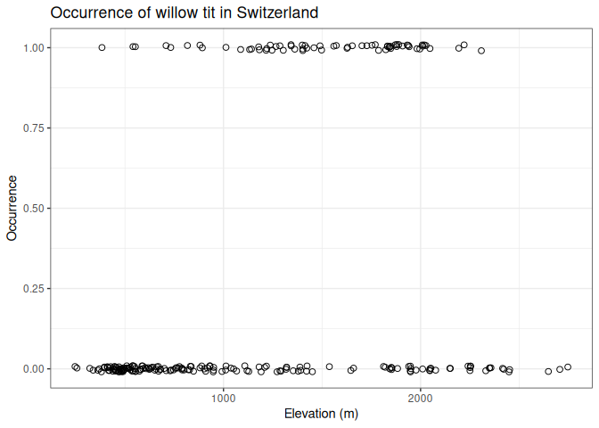
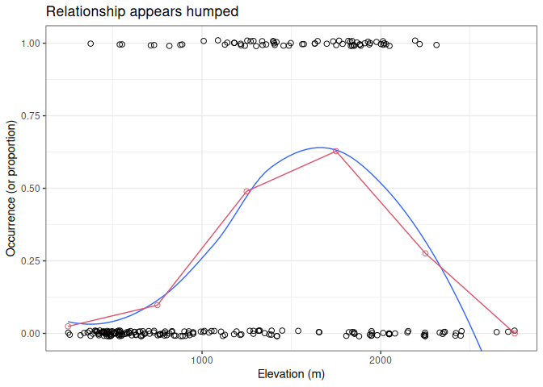

Swiss BBS EDA
================
Brett Melbourne
2025-11-12

``` r
library(ggplot2)
library(dplyr)
theme_set(theme_bw())
```

Read in the bird data. We’ll focus for now on the occurrence data from
year 1 in the column `y.1`.

``` r
willowtit <- read.csv("data/wtmatrix.csv") 
```

Here are the first 30 rows of data

``` r
willowtit |> 
    select(y.1, elev) |> 
    head(n=30)
```

    ##    y.1 elev
    ## 1    0  420
    ## 2    0  450
    ## 3    0 1050
    ## 4    0 1110
    ## 5    0  510
    ## 6    0  630
    ## 7    0  590
    ## 8    0  530
    ## 9    1 1140
    ## 10   0  770
    ## 11   0 1220
    ## 12   0  460
    ## 13   0 1010
    ## 14   0  760
    ## 15   1 1300
    ## 16   1 1270
    ## 17   0  380
    ## 18   1  550
    ## 19   0  390
    ## 20   0 1380
    ## 21   0  530
    ## 22   0 1190
    ## 23   1 1490
    ## 24   0  920
    ## 25   0  620
    ## 26   0  540
    ## 27   1  820
    ## 28   1 1220
    ## 29   1 1180
    ## 30   0  730

We see that the data for occurrence are binary with zeros coding for
absence and ones for presence. Confirming that we have only zeros and
ones:

``` r
unique(willowtit$y.1)
```

    ## [1] 0 1

Binary response variables are more challenging to visualize than
continuous variables. Plotting the raw zeros and ones data against
elevation is a little bit useful but not especially informative (we can
see that occurrences appear more often at mid elevation but that’s about
as good as we can perceive). I’ve jittered the points and used open
circles to help with overlap.

``` r
willowtit |> 
    ggplot() +
    geom_jitter(mapping=aes(x=elev, y=y.1), shape=1, size=2, height=0.01) +
    labs(x="Elevation (m)", y="Occurrence", 
         title="Occurrence of willow tit in Switzerland")
```

<!-- -->

Two useful approaches for visualizing binary data are binning and
smoothing. Here, we’ll bin elevation into 500 m increments and summarize
the binary records of occurrence. We set up bins, then calculate the
proportion present in each bin, then the midpoint of the bin. The
proportion of occurrences is the sum of the occurrences divided by the
number of observations; since the proportion is just the mean of a
binary variable, we can use the mean function.

``` r
freq_table <-
    willowtit |> 
    group_by(bin=cut(elev, breaks=seq(0, 3000, by=500))) |> 
    summarize(p=mean(y.1)) |> 
    mutate(mid=seq(250, 3000, by=500)) 
freq_table
```

    ## # A tibble: 6 × 3
    ##   bin                  p   mid
    ##   <fct>            <dbl> <dbl>
    ## 1 (0,500]         0.0244   250
    ## 2 (500,1e+03]     0.0972   750
    ## 3 (1e+03,1.5e+03] 0.490   1250
    ## 4 (1.5e+03,2e+03] 0.628   1750
    ## 5 (2e+03,2.5e+03] 0.276   2250
    ## 6 (2.5e+03,3e+03] 0       2750

Plot including the binned proportion and a smoother on the occurrence
data. Since the smoother is modeling the mean of the zeros and ones, it
is modeling a smooth function of the proportion of occurrences. The
smoother is probably the most useful technique.

``` r
willowtit |> 
    ggplot() +
    geom_jitter(mapping=aes(x=elev, y=y.1), shape=1, size=2, height=0.01) +
    geom_smooth(mapping=aes(x=elev, y=y.1), linewidth=0.5, se=FALSE) +
    geom_line(data=freq_table, 
              mapping=aes(x=mid, y=p), col=2) +
    geom_point(data=freq_table, 
               mapping=aes(x=mid, y=p), shape=1, size=2, col=2) +
    coord_cartesian(ylim=c(-0.01,1.01)) +
    labs(x="Elevation (m)", y="Occurrence (or proportion)", 
         title="Relationship appears humped")
```

    ## `geom_smooth()` using method = 'loess' and formula = 'y ~ x'

<!-- -->

The most striking feature in this plot is that the relationship appears
to be hump shaped. There is an optimal elevation for willow tits. Above
and below that elevation, the probability of occurrence appears lower.
