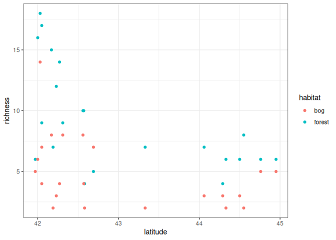
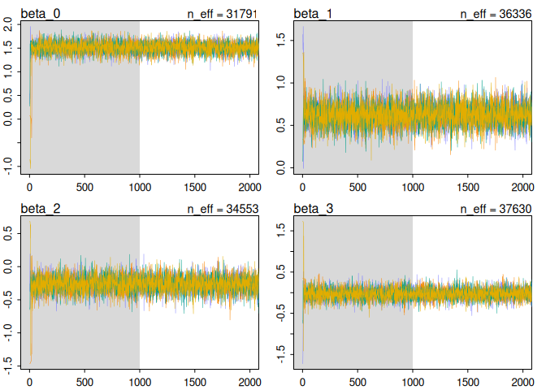
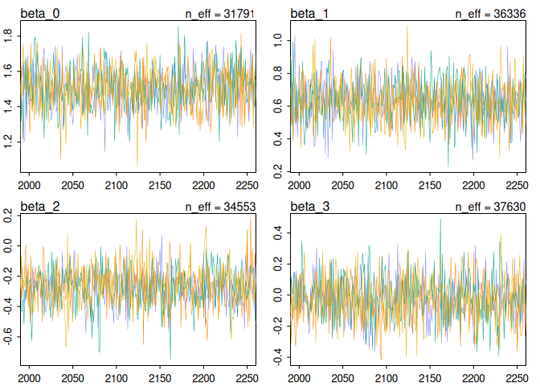
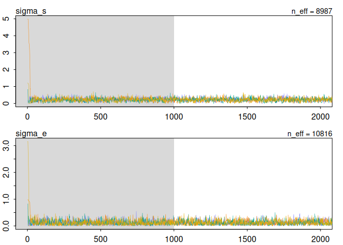
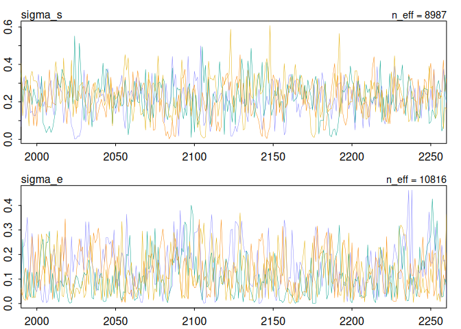
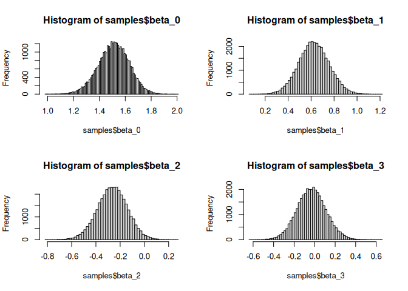
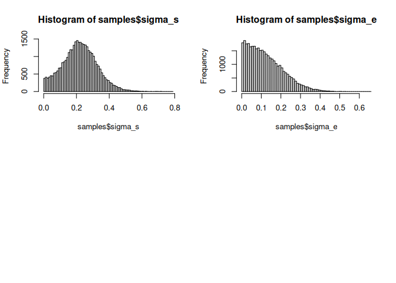
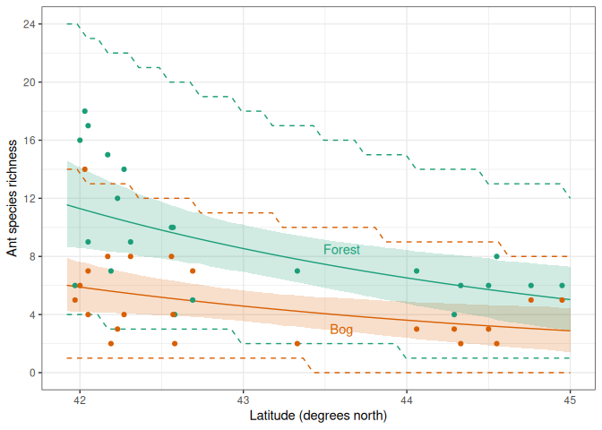
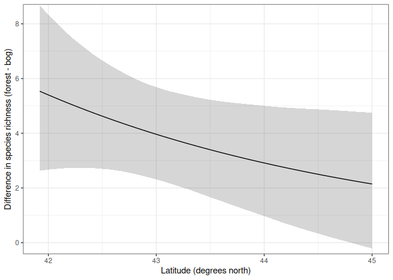

Bayesian training and inference, ants example
================
Brett Melbourne
1 Dec 2025

``` r
library(rethinking)
library(ggplot2)
theme_set(theme_bw())
set.seed(1901)
```

Read in and plot the data

``` r
ant <- read.csv("data/ants.csv")
ant$habitat <- factor(ant$habitat)
ggplot(ant) +
    geom_point(aes(x=latitude, y=richness, col=habitat))
```

<!-- -->

## Training

Bayesian fit with `ulam`, spelling out the model.

We first set up the data in a list with an indicator variable `forest`
and scaled latitude (center and divide by sd). With latitude unscaled
the training algorithm was very inefficient. This data structure is a
list, following the examples in McElreath, but a data frame would also
work since that is also a named list.

``` r
mean_lat <- mean(ant$latitude)
sd_lat <- sd(ant$latitude)
d <- list(
    richness = ant$richness,
    latitude_s = (ant$latitude - mean_lat) / sd_lat,
    forest = ifelse(ant$habitat == "forest", 1, 0)
)
d
```

    ## $richness
    ##  [1]  6 16 18 17  9 15  7 12 14  9 10 10  4  5  7  7  4  6  6  8  6  6  5  6 14
    ## [26]  7  4  8  2  3  4  8  8  4  2  7  2  3  3  2  3  2  5  5
    ## 
    ## $latitude_s
    ##  [1] -0.9813353 -0.9532972 -0.9252590 -0.9065669 -0.9065669 -0.7944143
    ##  [7] -0.7757222 -0.7383380 -0.7009538 -0.6635696 -0.4299183 -0.4205723
    ## [13] -0.4112262 -0.3084197  0.2897276  0.9719893  1.1869484  1.2243326
    ## [19]  1.3832155  1.4299458  1.6262128  1.8037878 -0.9813353 -0.9532972
    ## [25] -0.9252590 -0.9065669 -0.9065669 -0.7944143 -0.7757222 -0.7383380
    ## [31] -0.7009538 -0.6635696 -0.4299183 -0.4205723 -0.4112262 -0.3084197
    ## [37]  0.2897276  0.9719893  1.1869484  1.2243326  1.3832155  1.4299458
    ## [43]  1.6262128  1.8037878
    ## 
    ## $forest
    ##  [1] 1 1 1 1 1 1 1 1 1 1 1 1 1 1 1 1 1 1 1 1 1 1 0 0 0 0 0 0 0 0 0 0 0 0 0 0 0 0
    ## [39] 0 0 0 0 0 0

Now specify the model in full and train with `ulam`. It will take a
minute to compile, then it will sample from the posterior. I’m choosing
to compile and run with one chain at first to check that the model
compiles, then if all goes well, we’ll carry on.

``` r
bysfitHxL <- ulam(
    alist(
        richness ~ poisson(mu),
        log(mu) <- 
            beta_0 +
            beta_1 * forest +
            beta_2 * latitude_s +
            beta_3 * forest * latitude_s,
        beta_0 ~ normal(1, 10),
        beta_1 ~ normal(0, 10),
        beta_2 ~ normal(0, 10),
        beta_3 ~ normal(0, 10)
    ),
    data=d
)
```

    ## Running MCMC with 1 chain, with 1 thread(s) per chain...
    ## 
    ## Chain 1 Iteration:   1 / 1000 [  0%]  (Warmup) 
    ## Chain 1 Iteration: 100 / 1000 [ 10%]  (Warmup) 
    ## Chain 1 Iteration: 200 / 1000 [ 20%]  (Warmup) 
    ## Chain 1 Iteration: 300 / 1000 [ 30%]  (Warmup) 
    ## Chain 1 Iteration: 400 / 1000 [ 40%]  (Warmup) 
    ## Chain 1 Iteration: 500 / 1000 [ 50%]  (Warmup) 
    ## Chain 1 Iteration: 501 / 1000 [ 50%]  (Sampling) 
    ## Chain 1 Iteration: 600 / 1000 [ 60%]  (Sampling) 
    ## Chain 1 Iteration: 700 / 1000 [ 70%]  (Sampling) 
    ## Chain 1 Iteration: 800 / 1000 [ 80%]  (Sampling) 
    ## Chain 1 Iteration: 900 / 1000 [ 90%]  (Sampling) 
    ## Chain 1 Iteration: 1000 / 1000 [100%]  (Sampling) 
    ## Chain 1 finished in 0.0 seconds.

The model compiles and the training algorithm doesn’t complain. So, now
for a serious run with multiple chains and more iterations. There will
be a bunch of messages tracking progress of the chains.

``` r
bysfitHxL <- ulam(bysfitHxL, chains=4, cores=4, iter=2000)
```

    ## Running MCMC with 4 parallel chains, with 1 thread(s) per chain...
    ## 
    ## Chain 1 Iteration:    1 / 2000 [  0%]  (Warmup) 
    ## Chain 1 Iteration:  100 / 2000 [  5%]  (Warmup) 
    ## Chain 1 Iteration:  200 / 2000 [ 10%]  (Warmup) 
    ## Chain 1 Iteration:  300 / 2000 [ 15%]  (Warmup) 
    ## Chain 1 Iteration:  400 / 2000 [ 20%]  (Warmup) 
    ## Chain 1 Iteration:  500 / 2000 [ 25%]  (Warmup) 
    ## Chain 1 Iteration:  600 / 2000 [ 30%]  (Warmup) 
    ... 
    ## Chain 4 Iteration: 1300 / 2000 [ 65%]  (Sampling) 
    ## Chain 4 Iteration: 1400 / 2000 [ 70%]  (Sampling) 
    ## Chain 4 Iteration: 1500 / 2000 [ 75%]  (Sampling) 
    ## Chain 4 Iteration: 1600 / 2000 [ 80%]  (Sampling) 
    ## Chain 4 Iteration: 1700 / 2000 [ 85%]  (Sampling) 
    ## Chain 4 Iteration: 1800 / 2000 [ 90%]  (Sampling) 
    ## Chain 4 Iteration: 1900 / 2000 [ 95%]  (Sampling) 
    ## Chain 1 finished in 0.1 seconds.
    ## Chain 2 Iteration: 2000 / 2000 [100%]  (Sampling) 
    ## Chain 2 finished in 0.1 seconds.
    ## Chain 3 finished in 0.1 seconds.
    ## Chain 4 Iteration: 2000 / 2000 [100%]  (Sampling) 
    ## Chain 4 finished in 0.1 seconds.
    ## 
    ## All 4 chains finished successfully.
    ## Mean chain execution time: 0.1 seconds.
    ## Total execution time: 0.3 seconds.

Parameter summary information. We seem to have convergence as rhat = 1,
and we have efficient sampling as ess_bulk is high, indicating a large
effective sample size.

``` r
precis(bysfitHxL, prob=0.95, digits=4)
```

    ##               mean        sd       2.5%       97.5%     rhat ess_bulk
    ## beta_0  1.53503919 0.1032277  1.3351364  1.73495970 1.003032 1303.012
    ## beta_1  0.63236728 0.1273892  0.3788670  0.87346221 1.002503 1550.989
    ## beta_2 -0.28910514 0.1139256 -0.5141367 -0.06157735 1.002626 1307.680
    ## beta_3 -0.02194729 0.1402946 -0.3062593  0.25153019 1.001749 1210.962

Here is the stancode for this model

``` r
stancode(bysfitHxL)
```

    ## data{
    ##     array[44] int richness;
    ##      vector[44] latitude_s;
    ##     array[44] int forest;
    ## }
    ## parameters{
    ##      real beta_0;
    ##      real beta_1;
    ##      real beta_2;
    ##      real beta_3;
    ## }
    ## model{
    ##      vector[44] mu;
    ##     beta_3 ~ normal( 0 , 10 );
    ##     beta_2 ~ normal( 0 , 10 );
    ##     beta_1 ~ normal( 0 , 10 );
    ##     beta_0 ~ normal( 1 , 10 );
    ##     for ( i in 1:44 ) {
    ##         mu[i] = beta_0 + beta_1 * forest[i] + beta_2 * latitude_s[i] + beta_3 * forest[i] * latitude_s[i];
    ##         mu[i] = exp(mu[i]);
    ##     }
    ##     richness ~ poisson( mu );
    ## }

The above model does not include site-level and plot-level variation
that we included in our model for the data generating process. Here’s
how to add those. We first need to add site and plot identifiers to the
data.

``` r
d$site <- as.numeric(factor(ant$site)) #integer for each site
d$plot <- 1:44
```

Then in the model definition, we add `s` for site-level and `e` for
plot-level variation. There will be a unique deviation for each site,
and a unique deviation for each plot. We assume `s` and `e` are Normal
random variables, and since these deviations are on the scale of
`log(mu)` we are effectively adding lognormal variation. Overall, our
model is a Poisson-lognormal compound distribution. We need priors for
`sigma_s` and `sigma_e`. Many choices would work. For example, McElreath
typically uses Exponential(1) distributions. Gelman has previously
recommended a half-Cauchy distribution. After consulting the current
“Prior choice recommendations” at the Stan wiki under the heading “Prior
for scale parameters in hierarchical models”, we’ll use the currently
recommended half-Normal prior. A half-Normal distribution is Normal
centered at zero but the negative half is cut off so that `sigma_s` or
`sigma_e` will take only positive values.

``` r
bysfitHxL <- ulam(
    alist(
        richness ~ poisson(mu),
        log(mu) <- 
            beta_0 +
            beta_1 * forest +
            beta_2 * latitude_s +
            beta_3 * forest * latitude_s +
            s[site] + 
            e[plot],
        s[site] ~ normal(0, sigma_s),
        e[plot] ~ normal(0, sigma_e),
        beta_0 ~ normal(1, 10),
        beta_1 ~ normal(0, 1),
        beta_2 ~ normal(0, 1),
        beta_3 ~ normal(0, 1),
        sigma_s ~ half_normal(0, 1),
        sigma_e ~ half_normal(0, 1)
    ),
    data=d
)
```

    ## Running MCMC with 1 chain, with 1 thread(s) per chain...
    ## 
    ## Chain 1 Iteration:   1 / 1000 [  0%]  (Warmup) 
    ## Chain 1 Iteration: 100 / 1000 [ 10%]  (Warmup) 
    ## Chain 1 Iteration: 200 / 1000 [ 20%]  (Warmup) 
    ## Chain 1 Iteration: 300 / 1000 [ 30%]  (Warmup) 
    ## Chain 1 Iteration: 400 / 1000 [ 40%]  (Warmup) 
    ## Chain 1 Iteration: 500 / 1000 [ 50%]  (Warmup) 
    ## Chain 1 Iteration: 501 / 1000 [ 50%]  (Sampling) 
    ## Chain 1 Iteration: 600 / 1000 [ 60%]  (Sampling) 
    ## Chain 1 Iteration: 700 / 1000 [ 70%]  (Sampling) 
    ## Chain 1 Iteration: 800 / 1000 [ 80%]  (Sampling) 
    ## Chain 1 Iteration: 900 / 1000 [ 90%]  (Sampling) 
    ## Chain 1 Iteration: 1000 / 1000 [100%]  (Sampling) 
    ## Chain 1 finished in 0.1 seconds.

    ## Warning: 1 of 1 chains had an E-BFMI less than 0.3.
    ## See https://mc-stan.org/misc/warnings for details.

We’ll deal with the warning in a moment but first look at the Stan code.

``` r
stancode(bysfitHxL)
```

    ## data{
    ##     array[44] int richness;
    ##     array[44] int plot;
    ##     array[44] int site;
    ##      vector[44] latitude_s;
    ##     array[44] int forest;
    ## }
    ## parameters{
    ##      vector[22] s;
    ##      vector[44] e;
    ##      real beta_0;
    ##      real beta_1;
    ##      real beta_2;
    ##      real beta_3;
    ##      real<lower=0> sigma_s;
    ##      real<lower=0> sigma_e;
    ## }
    ## model{
    ##      vector[44] mu;
    ##     sigma_e ~ normal( 0 , 1 );
    ##     sigma_s ~ normal( 0 , 1 );
    ##     beta_3 ~ normal( 0 , 1 );
    ##     beta_2 ~ normal( 0 , 1 );
    ##     beta_1 ~ normal( 0 , 1 );
    ##     beta_0 ~ normal( 1 , 10 );
    ##     e ~ normal( 0 , sigma_e );
    ##     s ~ normal( 0 , sigma_s );
    ##     for ( i in 1:44 ) {
    ##         mu[i] = beta_0 + beta_1 * forest[i] + beta_2 * latitude_s[i] + beta_3 * forest[i] * latitude_s[i] + s[site[i]] + e[plot[i]];
    ##         mu[i] = exp(mu[i]);
    ##     }
    ##     richness ~ poisson( mu );
    ## }

Here we see that `ulam's` half Normal distribution for the `sigma_s`
prior is implemented in Stan as a Normal distribution with `sigma_s`
constrained as `real<lower=0> sigma_s` (same for `sigma_e`).

The training algorithm warned us of an `E-BFMI less than 0.3` and
checking the parameter summary, we find additional problems with
convergence (rhat \> 1) and efficiency of the chains (very low ess_bulk)
for `sigma_s` and especially `sigma_e`.

``` r
precis(bysfitHxL, prob=0.95, digits=4)
```

    ## 66 vector or matrix parameters hidden. Use depth=2 to show them.

    ##                mean         sd        2.5%       97.5%     rhat   ess_bulk
    ## beta_0   1.53218092 0.11167289  1.30051360  1.73306520 1.025348 177.537603
    ## beta_1   0.59881116 0.12497424  0.38427509  0.90351875 1.057356 176.757443
    ## beta_2  -0.23070365 0.12805846 -0.47026827 -0.02634507 1.034464  28.426743
    ## beta_3  -0.06339346 0.14523358 -0.29496164  0.25682321 1.006906  69.106405
    ## sigma_s  0.19180186 0.11445311  0.01780272  0.45472523 1.291451   2.886774
    ## sigma_e  0.12057321 0.08562275  0.02043077  0.31231260 1.500309   1.934803

This is an issue that often comes up with hierarchical models and the
HMC algorithm. The issue is that the physics simulation component of the
algorithm has trouble when the posterior surface is steep and narrow
resulting in inefficient exploration of the posterior. The solution is
often a reparameterization of the model called the non-centered
parameterization (see McElreath for more detailed explanation). The
small change is to draw `s` and `e` from a Normal(0, 1) instead of
Normal(0, sigma) and move the sigmas to the equation for `log(mu)`.

``` r
bysfitHxL <- ulam(
    alist(
        richness ~ poisson(mu),
        log(mu) <- 
            beta_0 +
            beta_1 * forest +
            beta_2 * latitude_s +
            beta_3 * forest * latitude_s +
            s[site] * sigma_s + 
            e[plot] * sigma_e,
        s[site] ~ normal(0, 1),
        e[plot] ~ normal(0, 1),
        beta_0 ~ normal(1, 10),
        beta_1 ~ normal(0, 1),
        beta_2 ~ normal(0, 1),
        beta_3 ~ normal(0, 1),
        sigma_s ~ half_normal(0, 1),
        sigma_e ~ half_normal(0, 1)
    ),
    data=d
)
```

    ## Running MCMC with 1 chain, with 1 thread(s) per chain...
    ## 
    ## Chain 1 Iteration:   1 / 1000 [  0%]  (Warmup) 
    ## Chain 1 Iteration: 100 / 1000 [ 10%]  (Warmup) 
    ## Chain 1 Iteration: 200 / 1000 [ 20%]  (Warmup) 
    ## Chain 1 Iteration: 300 / 1000 [ 30%]  (Warmup) 
    ## Chain 1 Iteration: 400 / 1000 [ 40%]  (Warmup) 
    ## Chain 1 Iteration: 500 / 1000 [ 50%]  (Warmup) 
    ## Chain 1 Iteration: 501 / 1000 [ 50%]  (Sampling) 
    ## Chain 1 Iteration: 600 / 1000 [ 60%]  (Sampling) 
    ## Chain 1 Iteration: 700 / 1000 [ 70%]  (Sampling) 
    ## Chain 1 Iteration: 800 / 1000 [ 80%]  (Sampling) 
    ## Chain 1 Iteration: 900 / 1000 [ 90%]  (Sampling) 
    ## Chain 1 Iteration: 1000 / 1000 [100%]  (Sampling) 
    ## Chain 1 finished in 0.2 seconds.

That looks better; there are no warnings. Here’s the Stan model

``` r
stancode(bysfitHxL)
```

    ## data{
    ##     array[44] int richness;
    ##     array[44] int plot;
    ##     array[44] int site;
    ##      vector[44] latitude_s;
    ##     array[44] int forest;
    ## }
    ## parameters{
    ##      vector[22] s;
    ##      vector[44] e;
    ##      real beta_0;
    ##      real beta_1;
    ##      real beta_2;
    ##      real beta_3;
    ##      real<lower=0> sigma_s;
    ##      real<lower=0> sigma_e;
    ## }
    ## model{
    ##      vector[44] mu;
    ##     sigma_e ~ normal( 0 , 1 );
    ##     sigma_s ~ normal( 0 , 1 );
    ##     beta_3 ~ normal( 0 , 1 );
    ##     beta_2 ~ normal( 0 , 1 );
    ##     beta_1 ~ normal( 0 , 1 );
    ##     beta_0 ~ normal( 1 , 10 );
    ##     e ~ normal( 0 , 1 );
    ##     s ~ normal( 0 , 1 );
    ##     for ( i in 1:44 ) {
    ##         mu[i] = beta_0 + beta_1 * forest[i] + beta_2 * latitude_s[i] + beta_3 * forest[i] * latitude_s[i] + s[site[i]] * sigma_s + e[plot[i]] * sigma_e;
    ##         mu[i] = exp(mu[i]);
    ##     }
    ##     richness ~ poisson( mu );
    ## }

Serious training run now. I’m going to bump up the iterations so we can
get good detail in the tails of the posterior distributions especially
for the two sigma parameters.

``` r
bysfitHxL <- ulam(bysfitHxL, chains=4, cores=4, warmup=1000, iter=10000)
```

    ## Running MCMC with 4 parallel chains, with 1 thread(s) per chain...
    ## 
    ## Chain 1 Iteration:    1 / 10000 [  0%]  (Warmup) 
    ## Chain 1 Iteration:  100 / 10000 [  1%]  (Warmup) 
    ## Chain 1 Iteration:  200 / 10000 [  2%]  (Warmup) 
    ## Chain 1 Iteration:  300 / 10000 [  3%]  (Warmup) 
    ## Chain 1 Iteration:  400 / 10000 [  4%]  (Warmup) 
    ## Chain 1 Iteration:  500 / 10000 [  5%]  (Warmup) 
    ## Chain 1 Iteration:  600 / 10000 [  6%]  (Warmup) 
    ...
    ## Chain 4 Iteration: 9400 / 10000 [ 94%]  (Sampling) 
    ## Chain 4 Iteration: 9500 / 10000 [ 95%]  (Sampling) 
    ## Chain 4 Iteration: 9600 / 10000 [ 96%]  (Sampling) 
    ## Chain 4 Iteration: 9700 / 10000 [ 97%]  (Sampling) 
    ## Chain 4 Iteration: 9800 / 10000 [ 98%]  (Sampling) 
    ## Chain 4 Iteration: 9900 / 10000 [ 99%]  (Sampling) 
    ## Chain 4 Iteration: 10000 / 10000 [100%]  (Sampling) 
    ## Chain 4 finished in 3.0 seconds.
    ## 
    ## All 4 chains finished successfully.
    ## Mean chain execution time: 2.2 seconds.
    ## Total execution time: 3.1 seconds.

Now we have good convergence and efficient sampling

``` r
precis(bysfitHxL, prob=0.95, digits=4)
```

    ## 66 vector or matrix parameters hidden. Use depth=2 to show them.

    ##                mean         sd         2.5%       97.5%      rhat  ess_bulk
    ## beta_0   1.51000061 0.11922498  1.266883263  1.73524697 0.9999417 31790.713
    ## beta_1   0.62489476 0.13180400  0.368555570  0.88542124 1.0000108 36336.353
    ## beta_2  -0.26445355 0.12377060 -0.510130642 -0.02644283 0.9999897 34552.606
    ## beta_3  -0.03043555 0.14098441 -0.304619827  0.25075621 0.9999960 37630.245
    ## sigma_s  0.22057020 0.10488810  0.022929003  0.43618026 1.0001703  8986.531
    ## sigma_e  0.12301204 0.08889853  0.005010206  0.32988770 1.0001020 10816.404

Inspect the traceplots

The beta chains are excellent. The sigma chains are not the most
efficient and do wander a bit and sometimes hover near zero for a few
iterations but I could not do any better with a longer warmup.

``` r
op <- par(no.readonly = TRUE) #copy the original graphics parameters
traceplot(bysfitHxL, pars=paste0("beta_", 0:3), window=c(0,2000), n_cols=2)
```

<!-- -->

``` r
traceplot(bysfitHxL, pars=paste0("beta_", 0:3), window=c(2000, 2250), n_cols=2)
```

<!-- -->

``` r
traceplot(bysfitHxL, pars=c("sigma_s", "sigma_e"), window=c(0,2000), n_cols=1)
```

<!-- -->

``` r
traceplot(bysfitHxL, pars=c("sigma_s", "sigma_e"), window=c(2000,2250), n_cols=1)
```

<!-- -->

``` r
par(op)
```

## Inference

All inferences are from the posterior samples

``` r
samples <- extract.samples(bysfitHxL)
class(samples)
```

    ## [1] "list"

``` r
str(samples)
```

    ## List of 8
    ##  $ s      : num [1:36000, 1:22] -1.633 1.17 0.149 1.15 -1.269 ...
    ##  $ e      : num [1:36000, 1:44] -0.913 0.179 -1.443 -0.596 -0.488 ...
    ##  $ beta_0 : num [1:36000, 1] 1.5 1.64 1.33 1.3 1.69 ...
    ##  $ beta_1 : num [1:36000, 1] 0.653 0.529 0.738 0.804 0.472 ...
    ##  $ beta_2 : num [1:36000, 1] -0.0845 -0.4469 -0.1258 -0.0643 -0.2039 ...
    ##  $ beta_3 : num [1:36000, 1] -0.2505 0.2007 -0.1091 -0.0919 -0.0511 ...
    ##  $ sigma_s: num [1:36000, 1] 0.2183 0.1852 0.2196 0.29 0.0955 ...
    ##  $ sigma_e: num [1:36000, 1] 0.183 0.211 0.29 0.15 0.195 ...
    ##  - attr(*, "source")= chr "ulam posterior from object"

``` r
names(samples)
```

    ## [1] "s"       "e"       "beta_0"  "beta_1"  "beta_2"  "beta_3"  "sigma_s"
    ## [8] "sigma_e"

Visualizing the posterior for each parameter

``` r
par(mfrow=c(2,2))
hist(samples$beta_0, breaks=75)
hist(samples$beta_1, breaks=75)
hist(samples$beta_2, breaks=75)
hist(samples$beta_3, breaks=75)
```

<!-- -->

``` r
hist(samples$sigma_s, breaks=75)
hist(samples$sigma_e, breaks=75)
```

<!-- -->

Parameter credible intervals directly from the samples

``` r
HPDI(samples$beta_0, prob=0.95)
```

    ##    |0.95    0.95| 
    ## 1.272471 1.740156

``` r
HPDI(samples$beta_1, prob=0.95)
```

    ##     |0.95     0.95| 
    ## 0.3668994 0.8828809

``` r
HPDI(samples$beta_2, prob=0.95)
```

    ##       |0.95       0.95| 
    ## -0.50891471 -0.02559291

``` r
HPDI(samples$beta_3, prob=0.95)
```

    ##      |0.95      0.95| 
    ## -0.3053920  0.2495172

``` r
HPDI(samples$sigma_s, prob=0.95)
```

    ##        |0.95        0.95| 
    ## 0.0003540504 0.3965328500

``` r
HPDI(samples$sigma_e, prob=0.95)
```

    ##        |0.95        0.95| 
    ## 1.205738e-05 2.905879e-01

Mean curves, intervals for curves (HPDI), posterior predictive
distribution. These are all derived quantities.

``` r
# Initialize a grid of latitudes, scaled the same as we scaled the data
lat_lwr <- (41.92 - mean_lat) / sd_lat
lat_upr <- (45 - mean_lat) / sd_lat
latitude_s <- rep(seq(from=lat_lwr, to=lat_upr, length.out=50), 2)
forest <- rep(0:1, each=50)

# Initialize storage
n <- length(latitude_s)
mn_hpdi <- matrix(NA, nrow=n, ncol=5) #to store mean and hpdi values
colnames(mn_hpdi) <- c("mnmu","mulo95","muhi95","ppdlo95","ppdhi95")

# For each latitude-habitat combination, form the posterior
for ( i in 1:n ) {
    
    # First form samples for the linear deterministic skeleton
    ln_mu <- samples$beta_0 + 
             samples$beta_1 * forest[i] + 
             samples$beta_2 * latitude_s[i] + 
             samples$beta_3 * forest[i] * latitude_s[i]
    
    # Then use inverse link for samples of the posterior \mu
    mu <- exp(ln_mu)
    
    # Sample from the data generating process to get the posterior predictive
    # distribution. This prediction is for a generic new plot at a new site,
    # which includes the stochasticity and parameter uncertainty for the site
    # and plot scales.
    n <- length(mu)
    s <- rnorm(n, mean=0, sd=samples$sigma_s)
    e <- rnorm(n, mean=0, sd=samples$sigma_e)
    lambda <- exp(ln_mu + s + e)
    ppd <- rpois(n, lambda)

    # Mean and intervals of these samples
    mn_hpdi[i,1] <- mean(mu)
    mn_hpdi[i,2:3] <- HPDI(mu, prob=0.95)
    #mn_hpdi[i,4:5] <- HPDI(ppd, prob=0.95)
    mn_hpdi[i,4:5] <- quantile(ppd, prob=c(0.025,0.975)) #CPI
    
}
rm(lat_lwr, lat_upr, n, ln_mu, mu, s, e, lambda, ppd) #clean up
```

Notice that we calculated expectations (e.g. `mean(mu)`) and intervals
directly on the scale of the data (the “response” scale), not on the
linear predictor scale. If we calculated first on the linear predictor
scale and then backtransformed the HPDI intervals to the response scale
they would be biased due to nonlinear averaging. Also, the posterior
predictive distribution (PPD) can, of course, only be on the response
scale. I used the CPI (`quantile()`) for the posterior predictive
distribution because plots of the HPDI and CPI were substantially
similar but the CPI was more numerically stable.

``` r
# Package in tidy format and plot
preds <- data.frame(
    habitat=ifelse(forest == 0, "bog", "forest"),
    latitude=latitude_s * sd_lat + mean_lat, 
    mn_hpdi)
rm(latitude_s, forest, mn_hpdi) #clean up

bfc <- c("#d95f02", "#1b9e77") #bog & forest colors
ggplot(preds) +
    geom_ribbon(aes(x=latitude, ymin=mulo95, ymax=muhi95, fill=habitat),
                alpha=0.2) +
    geom_line(aes(x=latitude, y=mnmu, col=habitat)) +
    geom_line(aes(x=latitude, y=ppdlo95, col=habitat), lty=2) +
    geom_line(aes(x=latitude, y=ppdhi95, col=habitat), lty=2) +
    geom_point(data=ant, aes(x=latitude, y=richness, col=habitat)) +
    annotate("text", x=43.6, y=3, label="Bog", col=bfc[1]) +
    annotate("text", x=43.6, y=8.5, label="Forest", col=bfc[2]) +
    scale_fill_manual(values=bfc) +
    scale_color_manual(values=bfc) +
    scale_y_continuous(breaks=seq(0, 24, 4), minor_breaks=seq(0, 24, 2)) +
    coord_cartesian(ylim=c(0, 24)) +
    xlab("Latitude (degrees north)") +
    ylab("Ant species richness") +
    theme(legend.position="none")
```

<!-- -->

Shaded areas are 95% credible intervals for the mean. Dashed lines are
95% prediction intervals.

**How different is species richness between habitats?**

We can see from the plot above that mean species richness is mostly
higher in forest than bog, judging by the non-overlap of the credible
intervals for the mean. We can also roughly read off the difference
(about 5.5 at latitude 42, or 2 at latitude 45). But we haven’t yet
precisely quantified this difference or its uncertainty. Let’s do that
next.

We need to derive the relevant quantities: the differences in mean
species richness between habitats at different latitudes. The first half
of this code is substantially the same as above; the main action is at
the line that calculates the difference (`diff`).

``` r
# Initialize variables and storage 
lat_lwr <- (41.92 - mean_lat) / sd_lat
lat_upr <- (45 - mean_lat) / sd_lat
latitude_s <- seq(from=lat_lwr, to=lat_upr, length.out=50)
n <- length(latitude_s)
forest_bog_diff <- matrix(NA, nrow=n, ncol=3) #to store mean and hpdi values
colnames(forest_bog_diff) <- c("mndiff","difflo95","diffhi95")

# For each latitude, form the posterior
for ( i in 1:n ) {
    
    # First form samples for the linear deterministic skeleton
    ln_mu_bog    <- samples$beta_0 + 
                    samples$beta_2 * latitude_s[i]
    ln_mu_forest <- samples$beta_0 + 
                    samples$beta_1 + 
                    samples$beta_2 * latitude_s[i] + 
                    samples$beta_3 * latitude_s[i]
    
    # Then use inverse link for samples of the posterior \mu
    mu_bog <- exp(ln_mu_bog)
    mu_forest <- exp(ln_mu_forest)
    
    # Now calculate the habitat difference (derived quantity)
    diff <- mu_forest - mu_bog
    
    # Mean and intervals of these samples
    forest_bog_diff[i,1] <- mean(diff)
    #forest_bog_diff[i,2:3] <- HPDI(diff, prob=0.95)
    forest_bog_diff[i,2:3] <- quantile(diff, prob=c(0.025,0.975)) #CPI
    
}

# Package in a dataframe (with latitude rescaled to original) & plot
diff_df <- data.frame(latitude=latitude_s * sd_lat + mean_lat,
                      forest_bog_diff)
rm(lat_lwr, lat_upr, latitude_s, n, forest_bog_diff, ln_mu_bog, ln_mu_forest,
   mu_bog, mu_forest, diff) #clean up

ggplot(diff_df) +
    geom_ribbon(aes(x=latitude, ymin=difflo95, ymax=diffhi95),
        alpha=0.2) +
    geom_line(aes(x=latitude, y=mndiff)) +
    coord_cartesian(ylim=c(0,8.3)) +
    xlab("Latitude (degrees north)") +
    ylab("Difference in species richness (forest - bog)")
```

<!-- -->

Difference declines with latitude, and we can see how the uncertainty
changes with latitude showing that mean ant richness in forest is
clearly higher than in bog across almost the entire range of latitudes.
