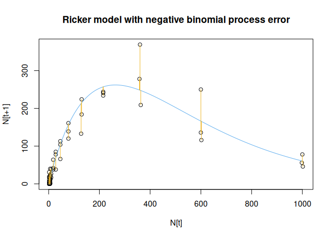
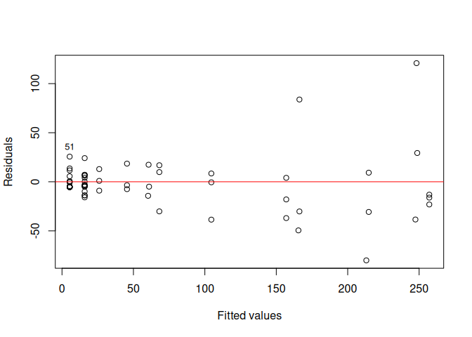
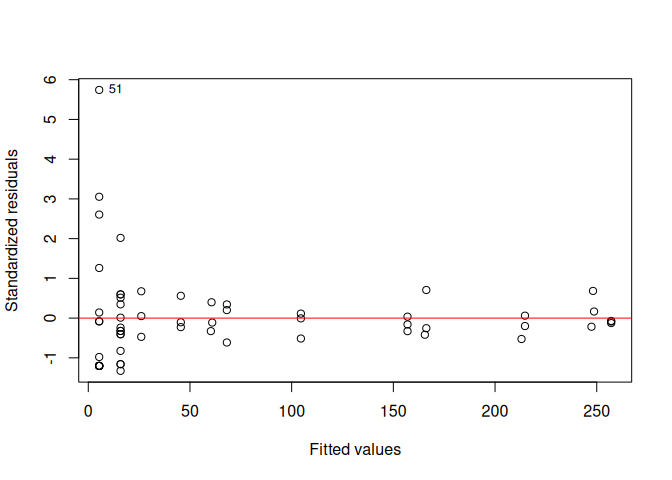
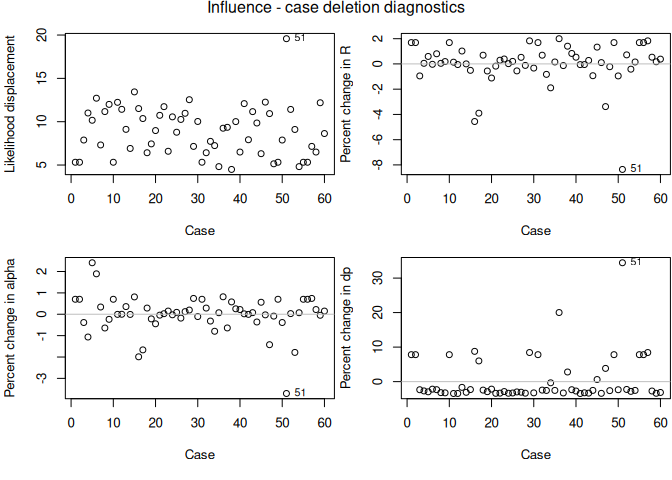

Model checking diagnostics for likelihood approaches
================
Brett Melbourne
18 Oct 2018 (updated 2 Dec 2025)

There are two scripts that demonstrate diagnostic procedures for
evaluating models fitted by likelihood methods. This is script 2, which
includes case deletion diagnostics that are useful for diagnosing
influence and outliers in the general likelihood case.

The model for the data generating process is a nonlinear stochastic
model for the population dynamics of a species of Tribolium beetle. Data
are from Melbourne & Hastings (2008) Nature 454: 100-103.

This model is set up for maximum likelihood estimation via `optim()`.
The model has three parameters to estimate: R, alpha, dp. The
deterministic skeleton is an ecological function for population growth
as a function of density with parameters R and alpha. The stochastic
part of the model is a negative binomial chosen because the outcome
variable (number of beetles) is discrete and positive and potentially
more variable than Poisson. The dispersion parameter dp of the negative
binomial distribution accounts for the variance beyond Poisson and needs
to be estimated also.

Is this proposed model for the data generating process reasonable?

## Function definitions

``` r
#--Ricker model (this is the nonlinear part)
# The input variable is Nt (initial abundance) and the outcome variable is Nt+1
# (abundance after 1 generation). We are modeling the outcome.
# Parameters
# R:      density independent growth rate
# alpha:  intraspecific competition intensity
# 
Ricker <- function(Nt, R, alpha) {
    Ntp1 <- Nt * R * exp( -alpha * Nt )
    return(Ntp1)
}

#--Likelihood - Negative binomial distribution
# Parameters (p) are passed to this function on a ln scale, which constrains
# them positive and improves the performance of optim.
# Parameter dp is in `dnbinom()`.
#
Ricker_nbinom_nll <- function(p, Nt, Ntp1) {
    R <- exp(p[1])  #Backtransform the parameters
    alpha <- exp(p[2])
    dp <- exp(p[3])  #dispersion parameter of negative binomial distribution
    mu <- Ricker(Nt, R, alpha) #the mean
    nll <- -sum(dnbinom(Ntp1, size=dp, mu=mu, log=TRUE))
    return(nll)
}

#--Variance of the Negative binomial Ricker
# This is the formula for the theoretical variance, a function of mu (mean) and
# dp (dispersion parameter).
#
Ricker_nbinom.var <- function(Nt, R, alpha, dp) {
    mu <- Ricker(Nt, R, alpha)
    var <- mu + mu * mu / dp
    return(var)
}
```

## Main program

``` r
data <- read.csv("data/tribolium.csv")
Nt <- data$Nt
Ntp1 <- data$Ntp1
```

Setup

``` r
n <- nrow(data)
case <- 1:n
R <- 2.71
alpha <- 0.0038
dp <- 1.99
p <- c(log(R), log(alpha), log(dp)) #starting parameter values on ln scale
```

Model trained via maximum likelihood on the full dataset. The BFGS
method turns out to have better performance here than the default
`optim()` method of Nelder-Mead.

``` r
fullfit <- optim(p, Ricker_nbinom_nll, Nt=Nt, Ntp1=Ntp1, method="BFGS")
fullphat <- exp(fullfit$par)
names(fullphat) <- c("R", "alpha", "dp")
fullnll <- fullfit$value
```

Plot the data and fitted values (predictions)

``` r
plot(Nt, Ntp1, main="Ricker model with negative binomial process error",
     xlab="N[t]", ylab="N[t+1]")
fv <- Ricker(Nt, fullphat["R"], fullphat["alpha"])
lines(0:1000, Ricker(0:1000, fullphat["R"], fullphat["alpha"]), col="steelblue2")
segments(Nt, fv, Nt, Ntp1, col="goldenrod2") #shows the residuals
```

<!-- -->

Residuals vs fitted is heteroscedastic as expected

``` r
r <- Ntp1 - fv
plot(fv, r, xlab="Fitted values", ylab="Residuals")
abline(h=0, col="red")
text(fv[case==51], r[case==51], "51", cex=0.8, pos=3)
```

<!-- -->

Standardized residuals are the residuals divided by their theoretically
expected standard deviation according to the negative binomial
distribution. Standardized residuals vs fitted values plot suggests that
smaller fitted values have larger residuals than expected and there is a
possible outlier.

``` r
sr <- r / sqrt(Ricker_nbinom.var(Nt, R, alpha, dp))
plot(fv, sr, xlab="Fitted values", ylab="Standardized residuals")
abline(h=0, col="red")
text(fv[case==51], sr[case==51], "51", cex=0.8, pos=4)
```

<!-- -->

Case deletion fits. Leave one out (LOO) algorithm. This is simply
refitting the model with each data point left out in turn. We record the
new parameter estimates and nll.

``` r
casedel <- matrix(nrow=n, ncol=4)
colnames(casedel) <- list("R", "alpha", "dp", "nll")
p <- log(fullphat)
for ( i in case ) {
    Nt <- data$Nt[-i]
    Ntp1 <- data$Ntp1[-i]
    fit <- optim(p, Ricker_nbinom_nll, Nt=Nt, Ntp1=Ntp1)
    casedel[i,1:3] <- exp(fit$par)
    casedel[i,4] <- fit$value
    print(paste("Deleted", i, "of", n, sep=" ")) #Monitoring
}
```

    ## [1] "Deleted 1 of 60"
    ## [1] "Deleted 2 of 60"
    ## [1] "Deleted 3 of 60"
    ## [1] "Deleted 4 of 60"
    ## [1] "Deleted 5 of 60"
    ## [1] "Deleted 6 of 60"
    ## [1] "Deleted 7 of 60"
    ...
    ## [1] "Deleted 53 of 60"
    ## [1] "Deleted 54 of 60"
    ## [1] "Deleted 55 of 60"
    ## [1] "Deleted 56 of 60"
    ## [1] "Deleted 57 of 60"
    ## [1] "Deleted 58 of 60"
    ## [1] "Deleted 59 of 60"
    ## [1] "Deleted 60 of 60"

Likelihood displacement

``` r
LD <- 2 * ( casedel[,"nll"] - fullnll )
```

Percent change in parameters

``` r
Rpc <- 100 * ( casedel[,"R"] - fullphat["R"] ) / fullphat["R"]
alphapc <- 100 * ( casedel[,"alpha"] - fullphat["alpha"] ) / fullphat["alpha"]
dppc <- 100 * ( casedel[,"dp"] - fullphat["dp"] ) / fullphat["dp"]
```

### Diagnostic plots

``` r
par(mfrow=c(2,2), mar=c(5,4,0,0) + 0.1, oma=c(0,0,2,0))

plot(case, abs(LD), xlab="Case", ylab="Likelihood displacement")
text(51, abs(LD)[51], "51", cex=0.8, pos=4)

plot(case, Rpc, xlab="Case", ylab="Percent change in R")
abline(h=0, col="gray")
text(51, Rpc[51], "51", cex=0.8, pos=4)

plot(case, alphapc, xlab="Case", ylab="Percent change in alpha")
abline(h=0, col="gray")
text(51, alphapc[51], "51", cex=0.8, pos=4)

plot(case, dppc, xlab="Case", ylab="Percent change in dp")
abline(h=0, col="gray")
text(51, dppc[51], "51", cex=0.8, pos=4)

mtext("Influence - case deletion diagnostics", 3, 1, outer=TRUE)
```

<!-- -->

### Conclusions

We investigated the potential outlier and didn’t find any mistakes in
the laboratory procedures or data handling. Taken together with the
residual plot, it seems that the negative binomial model is not a good
approximation for these data.

We ultimately concluded that a negative binomial model is a poor model
for the data generating process in population dynamics of sexually
reproducing species with discrete life histories. We devised a better
stochastic model for the data generating process by modeling the
stochastic ecological processes in more realistic detail. It turned out
that at small population sizes, variation among individuals in birth
rates and the probability of being female mattered a lot.
